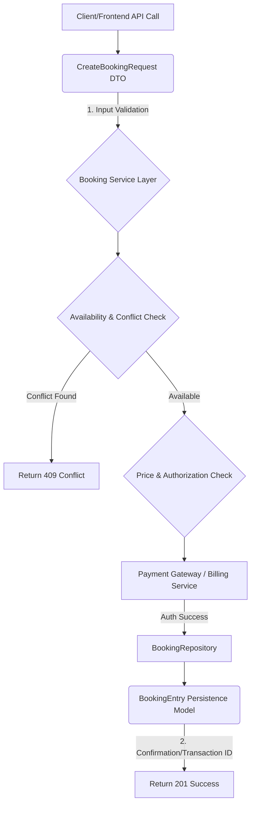

# 📁 `domain` Package Documentation: Booking Management

This document provides a comprehensive technical specification and design review for the core domain models governing booking transactions.

## 🚀 Overview

This package defines the fundamental data structures (`structs`) used within the application's domain layer for managing scheduled bookings. It separates the persistence model (`BookingEntry`) from the external input contract (`CreateBookingRequest`).

The module's primary function is to establish canonical data definitions for scheduling consultations, managing service details, and ensuring data integrity regarding timing and transactional status.

### 📊 Architectural Placement

| Component | Role | Knowledge Domain |
| :--- | :--- | :--- |
| `BookingEntry` | Persistence Model (Database Representation) | System Design, Data Integrity |
| `CreateBookingRequest` | Data Transfer Object (DTO) / API Input Contract | API Design |
| `domain` Package | Business Logic Boundary | Service Layer |

---

## ✨ Detail Analysis

### 1. `BookingEntry` (Persistence Model)

This struct represents a full, persisted booking record in the database. It contains comprehensive metadata necessary for workflow management and auditing.

#### 🌐 Field Breakdown

| Field | Type | Purpose | Constraints / Notes |
| :--- | :--- | :--- | :--- |
| `ID` | `string` | Unique identifier for the booking. | Primary Key. |
| `ConsultantID` | `string` | ID of the service provider. | Foreign Key reference to `Consultant` service. |
| `UserID` | `string` | ID of the client/user making the booking. | Foreign Key reference to `User` service. |
| `StartTime` / `EndTime` | `time.Time` | The scheduled start and end times. | **Critical:** Must satisfy `EndTime` $\ge$ `StartTime`. |
| `ServiceType` | `string` | Categorization of the service (e.g., 'video\_call', 'in\_person'). | Dictated by service catalog. |
| `Status` | `string` | Current state of the booking lifecycle. | Controlled workflow (e.g., `pending` $\to$ `confirmed` $\to$ `cancelled`). |
| `TotalPrice` | `float64` | Total cost associated with the booking. | Should align with billing logic. |
| `UserNotes` | `string` | Notes provided by the user. | Optional user input. |
| `CreatedAt` | `time.Time` | Timestamp of initial record creation. | Audit Trail. |
| `UpdatedAt` | `time.Time` | Timestamp of last record modification. | Audit Trail. |

### 2. `CreateBookingRequest` (API Input Contract)

This struct defines the expected payload schema when a client initiates a booking request via an external API endpoint. It acts as a streamlined Data Transfer Object (DTO).

#### 📤 Field Breakdown

| Field | Type | Source | Function |
| :--- | :--- | :--- | :--- |
| `ConsultantID` | `string` | Client/Front-end | Required ID for the service provider. |
| `StartTime` | `string` | Client/Front-end | **Critical:** Time must be received as an ISO-formatted string and requires backend parsing. |
| `ServiceType` | `string` | Client/Front-end | The type of service requested. |
| `UserNotes` | `string` | Client/Front-end | Optional notes. |
| `TotalPrice` | `float64` | Client/Front-end | The price estimate used for booking creation. |

---

## 📝 Documentation Notes and Best Practices

1. **Time Handling Standardization (Critical):** The mismatch between `time.Time` (internal model) and `string` (external request) is common but problematic. The service layer must implement robust date parsing (e.g., using `time.Parse` with a predefined layout) and handle parsing errors gracefully (returning a 400 Bad Request).
2. **Transaction Scope:** The creation of a booking is a multi-step, transactional process:
    *   *Validation* (Time, Conflicts, Availability).
    *   *Payment* (Authorization/Charge).
    *   *Persistence* (Creating the `BookingEntry`).
    *   The domain logic must ensure that steps are atomic.
3. **Concurrency Control:** The `Status` field is a primary concern for concurrency. When multiple requests might update a booking (e.g., one confirming, another cancelling), optimistic locking (using a version column or a database transaction lock) should be considered for `BookingEntry`.

---

## ⚠️ Security and Infrastructure Warnings (Action Items)

### 🔒 Security Concerns

1. **Authorization Check:** The current structs do not enforce *who* can make the API call. **ACTION REQUIRED:** Before any write operation (POST/PUT), the service layer **must** perform role-based and ownership validation checks (e.g., Is the `UserID` submitting the request the owner of the booking, or does the service account have global write permission?).
2. **Price Tampering:** The `TotalPrice` field is user-controllable via `CreateBookingRequest`. **WARNING:** The backend *must not* trust the `TotalPrice` submitted by the client. The final `TotalPrice` in `BookingEntry` should be calculated and overwritten by a trusted, server-side pricing microservice call to prevent fraud.
3. **Input Validation:** All string fields (IDs, ServiceType) must be validated against known enumerations or regex patterns to prevent injection attacks or invalid data being stored.

### ☁️ Infrastructure & System Design

1. **Time Zone Management:** Since time is handled by `time.Time`, the documentation must explicitly specify the required time zone (e.g., UTC, or the timezone of the primary API gateway). Storing all times in UTC is the industry standard best practice to avoid daylight savings and time zone ambiguity.
2. **System Boundary:** The domain model suggests a deep coupling between User, Consultant, and Booking. If the system grows, consider separating core entities into highly cohesive services (e.g., `UserService`, `SchedulingService`) that interact via asynchronous message queues (e.g., Kafka) rather than direct database reads, improving resilience.

---

## 🎨 Figure Representation (Conceptual Flow)

### Conceptual Data Flow Diagram: Creating a Booking

