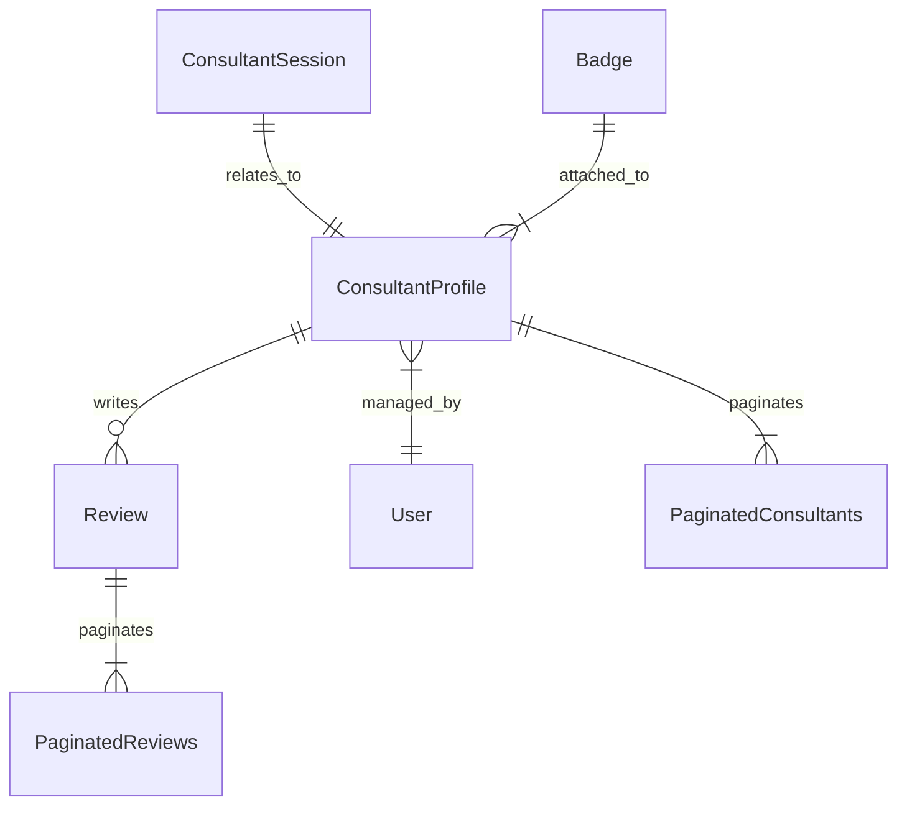

# 📄 Domain Models Definition: Consulting Platform

This document provides a comprehensive overview of the data models (`domain` package) used across the consulting platform. These models define the core entities such as consultant profiles, user reviews, and session management, forming the backbone of the system's data persistence and API contract.

---

## 💡 Overview

The `domain` package encapsulates all primary data structures required for the core functionality of the consulting platform. The models are designed to handle complex relationships between users, service providers (Consultants), and transactional data (Sessions/Reviews). Key architectural considerations include:

1.  **Pagination:** Structures are built around explicit pagination wrappers (`PaginatedConsultants`, `PaginatedReviews`) to ensure efficient API interactions and prevent large data payload transfers.
2.  **Data Typing:** Use of `uuid.UUID` for primary identifiers enforces globally unique and highly distributed primary key management.
3.  **Storage:** The inclusion of `db` struct tags indicates direct mapping to a SQL database (likely PostgreSQL, given the `pq.StringArray` usage), requiring careful consideration during ORM layer implementation.

### 🖼️ Conceptual Data Flow Diagram

The primary relationships are structured as follows:

---

## 🛠️ Detail: Model Specifications

The following sections detail each struct, its purpose, and its key fields.

### 👤 `ConsultantProfile` (Core Entity)

This is the comprehensive profile for a service consultant. It aggregates identity, professional credentials, and status information.

| Field | Type | Purpose | Description | Notes |
| :--- | :--- | :--- | :--- | :--- |
| `ID` | `uuid.UUID` | Primary Key | Unique identifier for the profile. | Maps to `id`. |
| `UserID` | `uuid.UUID` | Foreign Key | Links the profile to the system user account. | Maps to `user_id`. |
| `Name` | `string` | Basic Info | The consultant's full name. | Maps to `full_name`. |
| `DisplayName` | `string` | Presentation | Optimized name for display purposes. | Maps to `display_name`. |
| `AvatarURL`, `CoverURL` | `string` | Media Assets | URLs for profile images and cover banners. | |
| `GalleryImages` | `pq.StringArray` | Media Assets | List of image URLs for a gallery view. | Requires handling of array types in PostgreSQL. |
| `Bio`, `Quote` | `string` | Content | Professional biography and a catchy quote. | |
| `Rating` | `float64` | Metric | Average rating received from clients. | Maps to `rating_avg`. |
| `HelpedCount` | `int` | Metric | Count of services or clients helped. | Maps to `helped_count`. |
| `IsHighlyTrusted` | `bool` | Verification | Flag indicating platform verification status. | Maps to `is_verified`. |
| `HourlyRate` | `float64` | Billing | The standard hourly consultation rate. | |
| `City`, `Country` | `string` | Location | Geolocation data for the consultant. | |
| `Tags`, `Tags` | `[]string` | Skills/Niches | Categorization of expertise (e.g., "AI", "DevOps"). | Note the redundancy of `Tag` and `Tags` fields. |
| `Languages` | `pq.StringArray` | Skillset | List of languages spoken/supported. | |
| `JoinedAt` | `time.Time` | Timestamp | When the consultant joined the platform. | |
| `Badges`, `Reviews` | `[]Badge`, `[]Review` | Aggregated Data | Embedded lists of achievements and past reviews. | *Note: Embedding these relationships might cause data duplication issues.* |

### 🗓️ `ConsultantSession` (Transaction/Billing)

Defines a scheduled or completed consulting session. Critical for billing and resource allocation.

| Field | Type | Purpose | Description | Implications |
| :--- | :--- | :--- | :--- | :--- |
| `ID` | `uuid.UUID` | Primary Key | Unique session identifier. | |
| `ConversationID` | `uuid.UUID` | Foreign Key | Links to the primary communication thread. | |
| `PackageType` | `string` | Billing | Defines the type of package purchased (e.g., "1hr", "Premium"). | Used for billing logic. |
| `DurationHours` | `int` | Scope | The total duration booked in hours. | |
| `Status` | `string` | State Machine | Current state (e.g., "Pending", "Completed", "Canceled"). | Requires robust state management. |
| `PaidAt`, `StartedAt`, `ExpiresAt` | `time.Time` | Timestamps | Critical timing points for billing and session validity. | |

### ⭐ `Review` (Feedback)

Model representing a client review for a consultant.

| Field | Type | Purpose | Description | Considerations |
| :--- | :--- | :--- | :--- | :--- |
| `ID` | `uuid.UUID` | Primary Key | Unique review identifier. | |
| `ReviewerName`, `ReviewerAvatar` | `string` | Source Info | Details about the user who left the review. | |
| `Rating` | `int` | Metric | Numerical rating (e.g., 1 to 5). | |
| `Comment` | `string` | Content | The detailed written feedback. | |
| `VerifiedStay` | `bool` | Integrity | Confirms the reviewer actually used the service. | Critical for trust ranking. |
| `CreatedAt` | `time.Time` | Timestamp | When the review was submitted. | |

### 🏷️ Supporting Models

*   **`Niche`**: Defines a categorized skill or field (e.g., "Cloud Security", "Go Programming"). Used for filtering and discovery.
*   **`Badge`**: Represents a quantitative or qualitative indicator of trust (e.g., "5+ Years Experience", "Verified B2B Status").

---

## 📝 Note: Architectural & Development Best Practices

1.  **Data Normalization:** The current model embeds `[]Review` and `[]Badge` directly into `ConsultantProfile`. In a large-scale application, this structure is highly inefficient for database reads and write operations, violating normalization principles. **Recommendation:** These relationships should be handled via dedicated `ConsultantReviews` and `ConsultantBadges` junction tables, fetched dynamically, or via dedicated GraphQL fields.
2.  **API Consistency:** The use of `PaginatedConsultants` and `PaginatedReviews` correctly structures pagination parameters (`Data`, `TotalCount`, `Page`, `Limit`). This pattern should be adopted for all list-based API endpoints.
3.  **Time Zone Handling:** All `time.Time` fields (`JoinedAt`, `StartedAt`, etc.) must be stored and handled consistently using UTC time zones across the entire infrastructure to prevent temporal data corruption.

## ⚠️ Warning: Known Technical Limitations & Areas to Address

1.  **Redundancy in Tags:** The `ConsultantProfile` contains both `Tag string` and `Tags []string`. This is redundant and confusing. Standardize on using `Tags []string` (or, ideally, a linked ID list to a `Niche` table) and remove the single `Tag` field.
2.  **Database Array Handling:** The use of `pq.StringArray` implies reliance on PostgreSQL array types. If the infrastructure needs to be migrated to a different database system (e.g., MySQL or a NoSQL store), the data structure for `GalleryImages` and `Languages` will require significant rework (e.g., implementing JSONB arrays or separate linking tables).
3.  **Data Mutation Complexity:** When a consultant updates their profile, ensure that the `Rating`, `HelpedCount`, and calculated `Badges` are *recalculated* or updated via a dedicated, transactional service endpoint, rather than simply relying on the client to send updated aggregate values.

---
***Disclaimer:*** *This document is based on the provided Go domain model. Changes to the underlying business requirements may necessitate updates to these models and corresponding database migrations.*