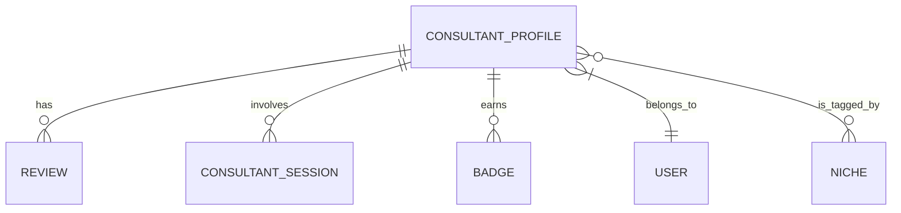

# 📚 Domain Models Specification

This document serves as the authoritative source for the core data structures (`domain` package) utilized throughout the system. It defines the contracts for all primary entities, ensuring consistency between the API layer, the business logic, and the underlying database schema.

***

[⬅ Return to Main Compendium](../../README.md)

## 🎯 Overview

The `domain` package encapsulates the complete data schema for the platform. It defines models for key actors (Consultants), interactions (Sessions, Reviews), and classification systems (Niches, Badges). These structs act as the single source of truth for data transfer objects (DTOs) and database object mapping.

**Goal:** To enforce a consistent, stable data contract that isolates the business logic from infrastructure changes (e.g., changing a column name means changing the `db` tag, but the application logic remains sound).

**Dependencies:** This package heavily relies on Go standard library features, `uuid` for primary keys, and `pq` (PostgreSQL) specific types for handling array columns.

---

## 💾 Detailed Model Specification

### 👤 `ConsultantProfile` (Core Entity)

This is the most comprehensive and critical model, representing a consultant's public and internal profile data.

| Field | Type | Database Column | Description | Usage Context |
| :--- | :--- | :--- | :--- | :--- |
| `ID` | `uuid.UUID` | `id` | Primary unique identifier for the profile. | Database Key |
| `UserID` | `uuid.UUID` | `user_id` | Foreign key linking to the core user account. | Identity Management |
| `Name` | `string` | `full_name` | Full legal name. | Display |
| `DisplayName` | `string` | `display_name` | User-chosen name for public display. | Display |
| `AvatarURL`, `CoverURL` | `string` | `avatar_url`, `cover_url` | Cloud storage URLs for media assets. | Presentation |
| `GalleryImages` | `pq.StringArray` | `gallery_images` | Array of URLs for supplementary images. | Media Display |
| `Bio`, `Quote` | `string` | `bio`, `quote` | Textual content used for marketing/description. | Content |
| `Rating` | `float64` | `rating_avg` | Calculated average rating (e.g., 4.7). | Metrics |
| `HelpedCount` | `int` | `helped_count` | Total number of sessions/clients served. | Metrics |
| `IsHighlyTrusted` | `bool` | `is_verified` | Flag indicating verification status. | Trust Indicator |
| `HourlyRate` | `float64` | `hourly_rate` | Cost per unit of time. | Billing/Pricing |
| `City`, `Country` | `string` | `city_name`, `country_code` | Location details. | Filtering/Search |
| `Tags`, `Tags` | `[]string` | `-` | Array of searchable skill tags (client-side optimized). | Search/Filtering |
| `Languages` | `pq.StringArray` | `languages` | List of languages spoken (DB array type). | Communication |
| `Badges`, `Reviews` | `[]Badge`, `[]Review` | *N/A (Embedded)* | Embedded relationship lists for display. | Presentation |

**Related Components:**
*   `[Consultant API Handlers](../../api/v1/consultant_handler.go)`: Logic that interacts with this profile data.
*   `[Consultant Repository Layer](../../repository/consultant_repo.go)`: Database interaction logic for profile updates.

### 📅 `PaginatedConsultants` / `PaginatedReviews`

These utility structs enforce standardized pagination responses, preventing the need for consumers to interpret raw dataset containers.

*   **Purpose:** Standardized API contract for list endpoints.
*   **Fields:** `Data` (`[]ConsultantProfile` or `[]Review`), `TotalCount` (total records available), `Page` (requested page number), `Limit` (items per page).

### 💼 `ConsultantSession` (Billing & Tracking)

This model tracks the lifecycle and billing details of a consultation session.

*   **Key Fields:** `ConversationID` (links to the chat system), `PackageType`, `DurationHours`.
*   **Critical Timestamps:** `StartedAt`, `ExpiresAt` (defining the active window), `PaidAt` (when payment was confirmed).
*   **Security Implication:** This model is crucial for financial auditing.

**Related Components:**
*   `[Payment Gateway Integrations](../../integrations/payment_service.go)`: Handles the `PaidAt` status update.

### 💬 `Review` (Feedback Mechanism)

Represents a single review submitted by a client.

*   **Fields:** `Rating` (integer score), `Comment` (detailed feedback).
*   **Validation Point:** The system must validate that the `ReviewerName`/`ReviewerAvatar` are sourced from an authenticated client ID to prevent spoofing.

### 🏷️ `Niche` / `Badge` (Classification & Trust)

These models handle categorization and trust signaling.

*   **`Niche`:** A simple, clean model for tagging consultants (e.g., "UX Design", "AI Ethics").
*   **`Badge`:** A powerful, flexible model. It defines a trust indicator (`Title`, `Description`) linked to a specific logic rule (`ID`, e.g., "tenure_gold").

---

## 📊 Conceptual Data Flow Diagram

The system exhibits a star schema pattern around the `ConsultantProfile` entity.

**Diagram Interpretation:**
1.  **Core Focus:** `ConsultantProfile` is the central entity.
2.  **Relationships:** Reviews, Sessions, Badges, and Niches are all ancillary data that augment the core profile.
3.  **Flow:** When a profile is fetched, the service layer must perform joins or batch lookups to compile the full, aggregated data object.

---

## 💡 Documentation Notes (Best Practices & Design Choices)

1.  **Serialization Strategy:** The separation of `json` tags and `db` tags is excellent practice. This assumes the use of an ORM/database mapping library (like `sqlx` or similar) which correctly maps struct fields to database columns while allowing Go struct fields (like `DisplayName`) to be optimized for API consumption.
2.  **Pagination Implementation:** The use of dedicated `Paginated*` structs is highly recommended. The API handlers responsible for listing consultants (`consultant_handler.go`) must enforce the `Page` and `Limit` parameters and ensure the `TotalCount` calculation is accurate (e.g., using `COUNT(*)` in the backend query).
3.  **`pq.StringArray` Usage:** Using PostgreSQL native arrays via `pq.StringArray` is efficient for storage but requires careful handling in Go, especially when validating input lengths or ensuring uniqueness before insertion.

---

## ⚠️ Warnings & Tech Debt (Future Scope)

### 1. Input Validation (Critical)
*   **Status:** Unimplemented.
*   **Issue:** None of the structs currently enforce validation rules (e.g., `Name` cannot be empty, `HourlyRate` must be $>0$, `Email` format).
*   **Recommendation:** Implement a validation interface (e.g., `validator.Validate() error`) on all data models. This should run in the service layer *before* data hits the repository layer.

### 2. Timezone Handling (High Priority)
*   **Issue:** All time fields (`JoinedAt`, `StartedAt`, `PaidAt`, `CreatedAt`) use `time.Time`. It is critical to confirm whether these times are stored in UTC (recommended) or local time.
*   **Recommendation:** Document and enforce that all timestamps are stored in **UTC** in the database and all APIs accept and return time representations standardized to UTC (`time.RFC3339`).

### 3. Read/Write Segregation (System Design)
*   **Issue:** The `ConsultantProfile` struct is used for both reading (API GET) and writing (API PUT/PATCH).
*   **Recommendation:** Consider creating specialized DTOs:
    *   `ConsultantReadDTO`: Minimal fields for list views.
    *   `ConsultantWriteDTO`: Only fields permitted for updates (e.g., exclude `ID`, `JoinedAt`, `Rating`).

### 4. Error Handling for Complex Fields
*   **Issue:** The `Tags` field uses `db:"-"` but is present in the struct. This means the business logic must handle the synchronization between the `Tags` slice (in memory) and the underlying database structure.
*   **Action:** Ensure the service layer abstracts this complexity, preventing the service implementation from needing to worry about manual mapping between the Go struct and the DB structure.