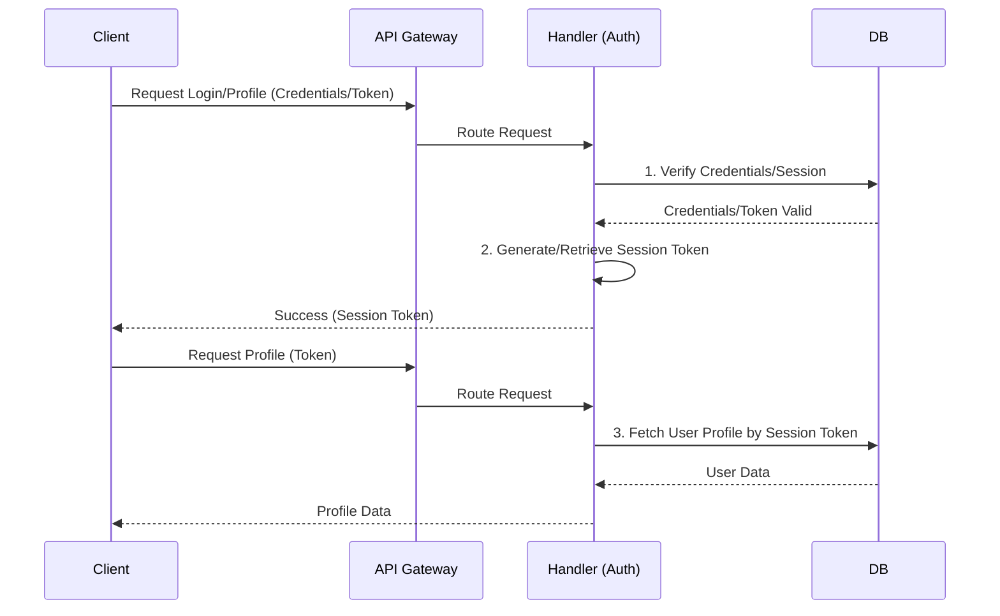

[⬅ Return to Main Compendium](../../README.md)

# 🛡️ Authentication Handler Module (auth.go)

This module handles all core user authentication flows, including user registration, login, session management, and retrieving the current user's profile (`GetMe`). It manages both general user accounts and specialized consultant profiles, maintaining session state using Redis.

---

## 📊 Overview

The `AuthHandler` struct provides the API endpoints and business logic for user identity management within the application. It enforces secure practices like password hashing using bcrypt and manages session state via Redis integration for stateless API design, while also handling transactional database operations for data consistency during registration.

### Key Flows Handled:
*   **Registration:** Creates a user record and optionally links it to a consultant profile.
*   **Login:** Validates credentials, creates a session, and issues a client cookie.
*   **Logout:** Invalidates the session token stored in Redis.
*   **GetMe:** Retrieves the profile data for the currently authenticated user.

## 🔬 Detail

### 💾 Core Components

| Component | Type | Purpose | Dependencies |
| :--- | :--- | :--- | :--- |
| `AuthHandler` | Struct | Manages repository dependencies (`UserRepo`, `ConsultantRepo`, `DB`). | `repository`, `sqlx`, `config` |
| `RegisterRequest` | Struct | Defines required payload for new user creation (Email, Password, Role, City details). | N/A |
| `LoginRequest` | Struct | Defines credentials needed for authentication (Email, Password). | N/A |

### 🧪 Functionality Breakdown

#### `Register(c *fiber.Ctx)`
This method handles new user sign-ups.
1.  **Validation:** Performs initial input validation. If `Role == "consultant"`, it validates the provided `CityName` against the local `cities` table.
2.  **Transaction Management:** Uses `db.Beginx()` to ensure atomicity. If any step fails (e.g., user creation or consultant profile creation), the transaction is rolled back (`defer tx.Rollback()`).
3.  **Security:** Hashes the plain text password using `bcrypt.DefaultCost`.
4.  **Profile Generation:** Calculates a default avatar URL using MD5 hash of the user's email.
5.  **Database Persistence:**
    *   Creates the primary `User` record.
    *   If the role is "consultant", it creates the related `Consultant` record, linking it via `UserID`.
6.  **Success:** Commits the transaction and returns a 201 status with the `user_id`.

#### `Login(c *fiber.Ctx)`
This method validates user credentials and establishes a session.
1.  **Authentication:** Retrieves the user by email and compares the submitted password using `bcrypt.CompareHashAndPassword`.
2.  **Role Determination:** Checks if the user has a corresponding record in the `consultants` table to determine the user's role.
3.  **Session Creation (Infra):** Generates a unique session token (`uuid.New().String()`). It stores this token mapping to the `user_id` in **Redis** (`config.RedisClient.Set`) with a 6-hour TTL.
4.  **Client Cookie:** Sets an HTTP-only cookie (`session_id`) containing the session token, enhancing security against XSS attacks.
5.  **Response:** Returns the user's profile data along with the session token.

#### `Logout(c *fiber.Ctx)`
Cleans up the session.
1.  **Token Retrieval:** Gets the token from the client cookie.
2.  **Cache Invalidation:** Deletes the corresponding session key from **Redis** (`config.RedisClient.Del`).
3.  **Cleanup:** Clears the `session_id` cookie from the client.

#### `GetMe(c *fiber.Ctx)`
Retrieves the currently logged-in user's profile.
1.  **Authorization Check:** Expects the `user_id` to be present in the Fiber context locals (usually set by middleware).
2.  **Profile Retrieval:** Fetches the `User` record using the provided ID.
3.  **Role Determination:** Re-checks the `consultants` table to accurately set the `role` field for the response body.
4.  **Output:** Returns a JSON map containing essential profile details.

### 🖼️ Data Flow Visualization

### Potential Improvements & Next Steps

*   **JWT Implementation:** Currently, session management relies on middleware (implied) to pass context. Migrating session handling to Bearer Token/JWT authentication will improve statelessness and scalability.
*   **Error Handling:** Implement standardized error responses (e.g., 401 Unauthorized, 404 Not Found) across all endpoints.
*   **Rate Limiting:** Add rate limiting middleware to prevent brute-force attacks on login endpoints.

---
*This documentation assumes the use of middleware to inject user context after successful authentication.*