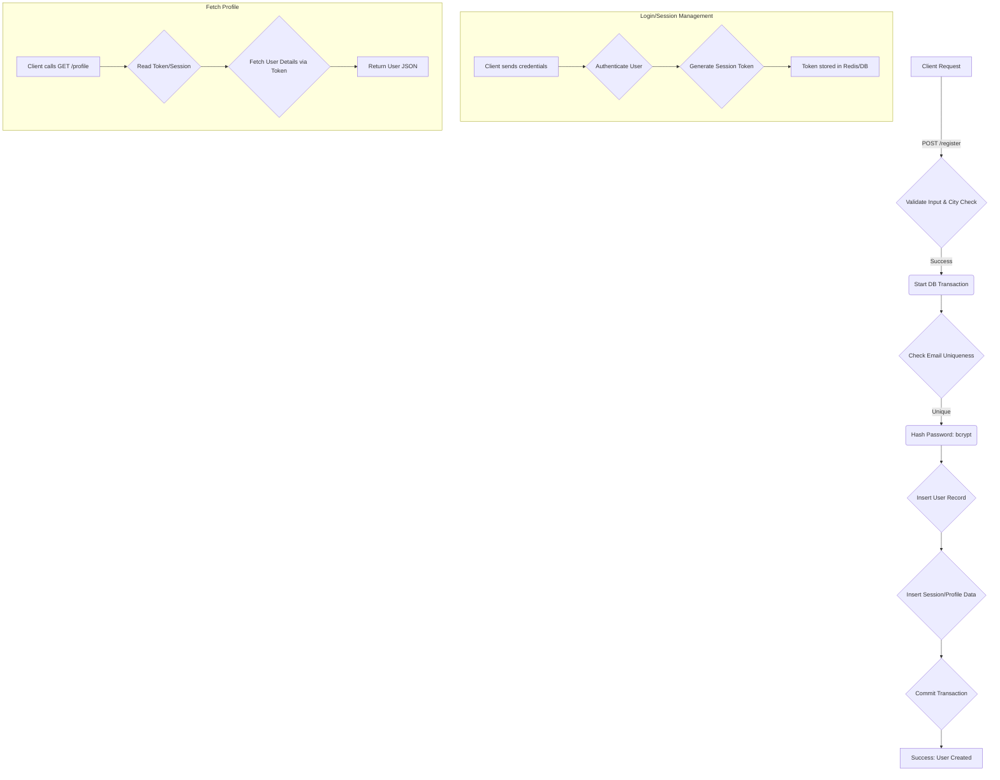

# 📚 Authentication Service Handler Documentation

**File:** `handler/auth_handler.go`
**Component:** `AuthHandler`
**Knowledge Domains:** System Design, Security, Infrastructure (Redis, Database), Backend API

## 🚀 Overview

This handler implements the core authentication and user management logic for the application. It manages user registration (including conditional profile creation for "consultants"), user login, session handling, and retrieving the currently authenticated user's profile details.

The handler utilizes a combination of technologies:
1. **Database (SQLX):** For persistence (User and Consultant data) and ensuring data integrity using transactions.
2. **Hashing:** `bcrypt` is used for robust password storage.
3. **Session Management (Redis):** Used to store and manage active user sessions, decoupling authentication state from the stateless nature of API calls.
4. **Framework:** Built upon the [Fiber](https://github.com/gofiber/fiber/v2) web framework.

## ✨ Detail

### 🏗️ Core Structure and Components

The `AuthHandler` struct holds references to the necessary repositories (`UserRepo`, `ConsultantRepo`) and the database connection pool (`DB`) to perform CRUD operations.

#### `Register(c *fiber.Ctx)`

Handles the creation of new user accounts.

1. **Input Validation:** Checks for required fields and performs initial role-based validation (e.g., if `Role == "consultant"`, `CityName` must be provided).
2. **City Lookup:** If the user is a consultant, it queries the database to ensure the provided `CityName` corresponds to a valid `CityID`.
3. **Transaction Management:** Initiates a database transaction (`tx`). All user and profile creations must succeed within this transaction to ensure atomicity.
4. **Uniqueness Check:** Verifies if the email already exists.
5. **Security:** Hashes the password using `bcrypt`. Calculates a deterministic `AvatarURL` seed based on the user's email.
6. **Persistence:** Creates the core `User` record.
7. **Conditional Profile Creation:** If the role is "consultant", it uses the newly created `user.ID` to create a corresponding `Consultant` record, all within the same transaction.
8. **Commit/Rollback:** Commits the transaction only if all steps succeed; otherwise, it rolls back to prevent partial data writes.
9. **Response:** Returns a 201 status upon success, providing the new `user_id`.

#### `Login(c *fiber.Ctx)`

Authenticates the user and establishes a session.

1. **Authentication:** Retrieves the user by email and validates the provided password against the stored `bcrypt` hash.
2. **Role Determination:** Queries the database to determine if the user has an associated entry in the `consultants` table, thereby setting the `role`.
3. **Session Creation:** Generates a unique UUID session token.
4. **Infrastructure Interaction:** Sets the session token (`session:UUID`) in Redis with an expiration of 6 hours.
5. **Cookie Issuance:** Sets a `session_id` cookie on the client (recommended security headers are used: `HttpOnly`, `SameSite: Lax`).
6. **Response:** Returns a JSON payload containing the session token and the user's profile details (including calculated role and potentially `consultant_id`).

#### `Logout(c *fiber.Ctx)`

Terminates the user session.

1. **Token Extraction:** Retrieves the session token from the client's cookies.
2. **Session Invalidation:** Deletes the corresponding key (`session:token`) from Redis, immediately revoking access.
3. **Client Cleanup:** Clears the `session_id` cookie on the client side.
4. **Response:** Returns a 200 status indicating successful logout.

#### `GetMe(c *fiber.Ctx)`

Retrieves the profile of the currently authenticated user.

1. **Authorization Check:** Relies on `c.Locals("user_id")` being present (implying middleware has run and attached the user ID).
2. **User Retrieval:** Fetches the user details by ID from the database.
3. **Role Check:** Performs a secondary database query to check the `consultants` table, ensuring the `role` attribute is accurately set.
4. **Response:** Returns a structured JSON payload containing the user's most up-to-date profile information.

---
### 🖼️ Flowchart Representation (Conceptual)

---

### ⚠️ Potential Improvements & Next Steps

*   **Error Handling:** Currently, the code relies heavily on HTTP/framework error handling. Explicitly wrapping database calls in `try...catch` blocks would improve resilience.
*   **Password Hashing:** While `bcrypt` is mentioned, ensure the actual hashing implementation is robust and handles salt generation correctly.
*   **Role-Based Access Control (RBAC):** Implement middleware checks on all endpoints to ensure the authenticated user has the necessary permissions before allowing access.
*   **Rate Limiting:** Protect the login and registration endpoints from brute-force attacks by implementing rate limiting using Redis.
*   **Token Refresh:** Implement a secure JWT/token refresh mechanism to ensure users don't have to log in repeatedly.