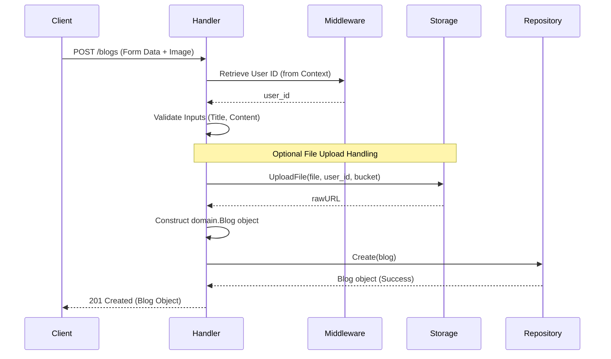
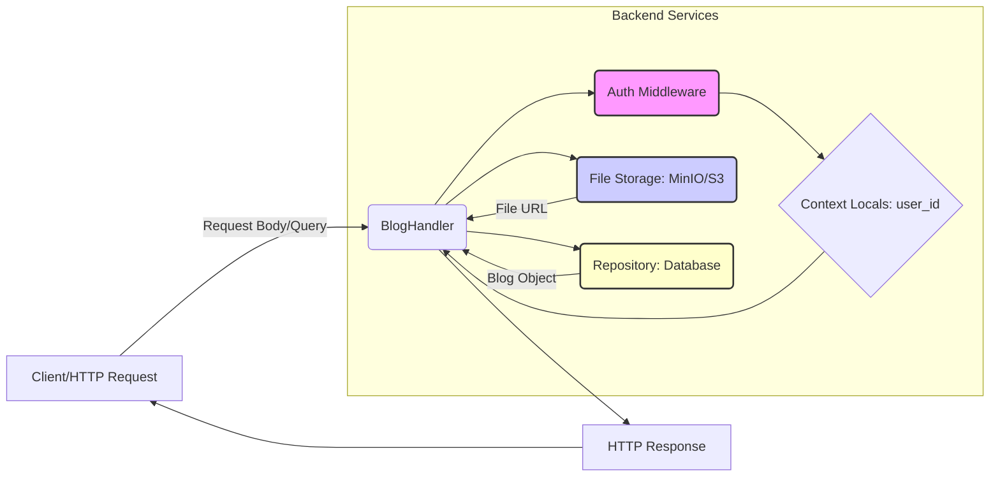

[⬅ Return to Main Compendium](../../README.md)

# 📖 Blog Service Handler Layer (`handler/`)

This module contains the concrete HTTP handler logic for managing blog post resources. It acts as the presentation layer entry point for the API, coordinating inputs, calling service/repository logic, and formatting the HTTP response.

## 🌟 Overview

The `BlogHandler` is responsible for implementing the core business logic endpoints for the blog feature. It interacts with the authentication context (user ID), the file storage system (for cover images), and the database repository to perform CRUD operations.

**Key Responsibilities:**
1.  **Request Handling:** Parsing form values, query parameters, and path parameters.
2.  **Business Logic Enforcement:** Validating mandatory fields (e.g., title and content).
3.  **Orchestration:** Managing the flow from file upload $\rightarrow$ model creation $\rightarrow$ database persistence.

---

## ⚙️ Detailed Component Breakdown

The `BlogHandler` depends on three major infrastructure components: `fiber` (HTTP context), `storage` (MinIO/S3), and `repository` (Database access).

### 💻 `Create(c *fiber.Ctx)` - Create Blog Post (POST)

Handles the creation of a new blog post. This is the most complex endpoint as it involves multiple dependencies.

**Flow Diagram:**



**Steps:**
1.  **Authentication:** Extracts `user_id` from the request context (`c.Locals("user_id")`).
2.  **Input Parsing:** Reads `title`, `content`, `summary`, `city`, and `country` from the form data.
3.  **Image Handling:** If `cover_image` is provided, it is uploaded to the configured storage (`h.Storage.UploadFile`). The URL is then cleaned and stored.
4.  **Model Creation:** A new `domain.Blog` instance is populated, generating `ID`, setting `AuthorID`, and recording timestamps.
5.  **Persistence:** Calls `h.Repo.Create(blog)` to save the record to the database.

**Status Codes:**
*   `201 Created`: Successful creation.
*   `400 Bad Request`: Missing required fields or invalid user ID.
*   `500 Internal Server Error`: Failure during image upload or database write.

### 📋 `List(c *fiber.Ctx)` - List All Blogs (GET)

Fetches a paginated and filterable list of blog posts.

**Process:**
1.  Reads optional query parameters: `city`, `country`, and `author_id`.
2.  Constructs a `repository.BlogFilter` object using these inputs, setting a default limit (20).
3.  Calls `h.Repo.List(filter)` to retrieve the list.
4.  Returns the list of blogs directly.

**URL Example:** `/blogs?city=Rome&country=Italy&author_id=uuid_abc`

### 🖼️ `Get(c *fiber.Ctx)` - Get Single Blog (GET)

Retrieves a single blog post using its unique identifier.

**Process:**
1.  Extracts the `id` from the URL path parameters (`c.Params("id")`).
2.  Parses the ID string into a `uuid.UUID` type, validating its format.
3.  Calls `h.Repo.GetByID(id)`.
4.  Returns the single blog object.

**Status Codes:**
*   `200 OK`: Blog found and returned.
*   `400 Bad Request`: Invalid format for the provided ID.
*   `404 Not Found`: No blog exists with the given ID.

---

## ⚠️ Notes and Warnings (Security & Technical Debt)

### ⚠️ Security & Authentication Concerns (Critical)

1.  **User Context Dependency:** The `Create` method relies entirely on the `c.Locals("user_id")` context variable. **It is absolutely critical that the authentication middleware runs immediately before this handler.** If the middleware fails or is bypassed, the `userID` will be incorrect, leading to data integrity issues (e.g., attributing a post to an unknown user).
    *   *Related Module:* This dependency links directly to the assumed authentication flow within `../middleware/auth.go`.
2.  **Error Leakage:** The handler returns database errors via `detail: err.Error()` in the 500 status response. In production, generic error messages must be used, and specific database error handling should be implemented at the repository layer to prevent revealing backend schema or connectivity details to the client.

### 💡 Design and Code Improvements (Tech Debt)

1.  **URL Replacement Logic:** The line `coverImageURL = strings.Replace(rawURL, ":9001", ":9000", 1)` is brittle. It relies on knowing specific port numbers being changed between staging and production. Instead, the file storage service should ideally return fully canonical URLs based on the deployment environment configuration, eliminating manual string manipulation.
2.  **Contextualizing Inputs:** When fetching the `user_id`, the code performs `uuid.Parse(userIDStr)` *after* retrieving it from the context. It is better practice to validate the type and format of the data as close to the context retrieval point as possible, possibly by adding specific type assertions or error checks within the middleware itself.

---

## 🚀 System Design / Infrastructure Flow

### Components Interaction Diagram



### 🧩 Related Code Flow Links

For tracing the full lifecycle of a blog post, refer to these related modules:

*   **Authentication Flow:** The acquisition of `user_id` is handled by the middleware layer. Please check the implementation details here:
    *   [Authentication Middleware Logic](../middleware/auth)
*   **Database Interaction:** The specific filtering and retrieval logic is housed in the repository layer.
    *   [Blog Repository Interface and Implementation](../repository/blog_repository)
*   **Domain Model:** The canonical structure for the blog post.
    *   [Blog Domain Model](../domain/blog)
```