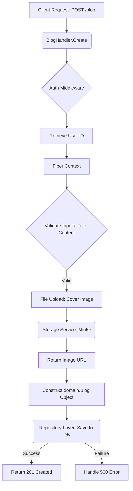

# 📚 Blog Handler Service Documentation

This document provides a comprehensive overview of the `BlogHandler` package, which serves as the API layer (Controller/Handler) for managing blog posts within the application. It is responsible for handling incoming HTTP requests, orchestrating data flow between the HTTP context, the business logic repository, and external storage services.

## 📄 Overview

The `BlogHandler` is a Go service component built on the Fiber framework. It implements the core API endpoints for blog functionality, including creating new posts, listing filtered posts, and retrieving individual posts by ID.

Architecturally, the handler follows the Controller pattern, acting as the primary interface between the HTTP request and the internal application layers (Repository and Storage). It enforces crucial application constraints such as user authentication checks and data validation before persisting data.

### 🚀 Usage Summary

| Endpoint | HTTP Method | Description | Dependencies |
| :--- | :--- | :--- | :--- |
| `/blog` | `POST` | Creates a new blog post. Requires `title`, `content`, and optionally a cover image. | `BlogRepository`, `FileStorage` |
| `/blog` | `GET` | Lists blog posts, supporting filtering by city, country, or author ID. | `BlogRepository` |
| `/blog/:id` | `GET` | Retrieves a single blog post by its unique ID. | `BlogRepository` |

## ⚙️ Detailed Implementation Analysis

### 1. Component Structure

The `BlogHandler` struct holds necessary dependencies, ensuring proper separation of concerns:

```go
type BlogHandler struct {
	Repo    *repository.BlogRepository // Handles database interaction (persistence)
	Storage storage.FileStorage       // Handles external file uploads (e.g., MinIO/S3)
}
```

### 2. Workflow Deep Dive (Create Function)

The `Create` method demonstrates a complex, multi-stage data pipeline:

1. **Authentication Retrieval:** It securely retrieves the `user_id` from the Fiber context locals, assuming a preceding authentication middleware has populated this data.
2. **Input Validation:** It validates required fields (`title` and `content`) and parses the user ID, returning a `400 Bad Request` on failure.
3. **Object Storage Handling:** It attempts to process an optional `cover_image` file.
    *   The file is uploaded to the external storage service (`h.Storage.UploadFile`).
    *   It performs a manual string replacement (`strings.Replace(rawURL, ":9001", ":9000", 1)`) to correct the URL, suggesting an endpoint mapping adjustment is needed or expected in the infrastructure configuration.
4. **Domain Model Construction:** It constructs the `domain.Blog` object, populating all fields including `uuid.New()` for primary keys and setting precise `CreatedAt`/`UpdatedAt` timestamps.
5. **Persistence:** The finalized model is passed to `h.Repo.Create()`.

### 3. Filtering and Retrieval (List & Get)

*   **`List`:** This method effectively uses query parameters (`c.Query`) to build a structured `repository.BlogFilter` object. This design pattern makes the handler agnostic to how the repository actually executes the query (e.g., SQL `WHERE` clause, NoSQL query filter).
*   **`Get`:** This method handles path parameters (`c.Params("id")`) and robustly validates the UUID format, ensuring the database lookup only proceeds with valid identifiers.

## 💡 Notes for Development and Maintenance

*   **Error Handling Consistency:** When returning errors, the handler consistently uses structured JSON responses (e.g., `fiber.Map{"error": "...", "detail": "..."}`). This practice should be maintained across all services for standardized client consumption.
*   **Dependency Injection:** The use of dependency pointers (`*repository.BlogRepository`, `storage.FileStorage`) is excellent practice, ensuring the `BlogHandler` is highly testable and decoupled from concrete infrastructure implementations.
*   **MinIO/URL Correction:** The line `coverImageURL = strings.Replace(rawURL, ":9001", ":9000", 1)` is a temporary fix or a symptom of an infrastructure misalignment. If the deployment environment changes (e.g., moving from local MinIO port 9001 to 9000), this hardcoded replacement logic might break. **The storage service layer should ideally handle URL generation/normalization.**

## ⚠️ Security and Improvement Warnings

### 🛑 High Priority: Security Concerns

1.  **Input Sanitization:** While the handler validates the presence of fields, it does not explicitly mention sanitization for textual inputs (`title`, `content`, `summary`). If the content is rendered directly to HTML by the client or another backend service without sanitization, this creates a potential **Cross-Site Scripting (XSS)** vulnerability. Always sanitize user-generated content.
2.  **Rate Limiting:** This handler does not implement rate limiting. Unauthorized use could lead to resource exhaustion or denial-of-service conditions. Implementing rate limiting middleware is strongly recommended, particularly on the `POST` endpoint.

### 📐 Architectural Improvements (Medium Priority)

1.  **Image Handling Abstraction:** The file upload logic is tightly coupled within the `Create` method. Consider abstracting the image upload into a dedicated helper function or service that the `BlogHandler` calls, which would centralize error logging and URL manipulation.
2.  **Consistency in Error Responses:** While the pattern is good, consider defining standardized error codes/enums instead of just relying on string messages for machine-readable error handling.

## 🗺️ Diagrammatic Flow (Conceptual)

