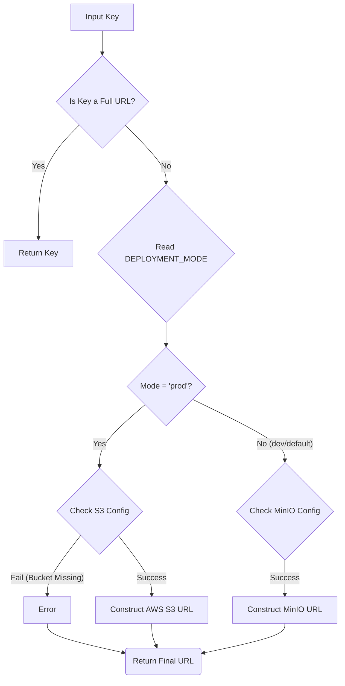

# `helper/media_url_builder.go` Documentation

## 📄 Overview

This package provides utility functions primarily designed to construct the correct public URL for media assets. Instead of storing full, potentially complex URLs in the database, the system stores a simple object key. The `BuildMediaURL` function intelligently constructs the fully qualified media URL based on the current deployment environment (`dev` or `prod`) and the configured storage backend (AWS S3 or MinIO).

The function abstracts away the complexities of endpoint construction, making the calling code cleaner and more portable across different deployment environments.

---

## ⚙️ Detail Analysis

### 🚀 Function: `BuildMediaURL(key string) (string, error)`

This function takes a media object key (a string) and returns the corresponding public URL.

#### **Inputs:**

*   `key` (`string`): The raw object key of the media asset (e.g., `user/profile/image.jpg`).

#### **Outputs:**

*   `string`: The fully constructed public URL.
*   `error`: An error if required environment variables for the production environment are missing.

#### **Execution Logic & Deployment Modes:**

The function first checks if the `key` already looks like a full URL (starts with `http` or is empty). If so, it is returned as is. Otherwise, it reads the `DEPLOYMENT_MODE` environment variable to determine the URL construction logic:

1.  **`prod` (Production Mode - AWS S3):**
    *   Requires `AWS_S3_MEDIA_BUCKET` and `AWS_DEFAULT_REGION`.
    *   Constructs the URL using the standard AWS S3 format: `https://[BUCKET].s3.[REGION].amazonaws.com/[KEY]`
    *   **Error Handling:** Returns an error if `AWS_S3_MEDIA_BUCKET` is not set.
2.  **`dev` (Development Mode - MinIO):**
    *   If `DEPLOYMENT_MODE` is unset, it defaults to `dev`.
    *   Uses MinIO/Local storage configuration.
    *   Default `MINIO_PUBLIC_URL`: `http://localhost:9000`
    *   Default `MININO_MEDIA_BUCKET`: `lokask-media`
    *   Constructs the URL using the format: `[MINIO_PUBLIC_URL]/[MININO_MEDIA_BUCKET]/[KEY]`
3.  **Error Handling:** Returns a standard error if required variables (like the S3 bucket name) are missing in production.

#### **Internal Dependencies (Environment Variables):**

| Variable Name | Purpose | Required For | Default Value (if applicable) |
| :--- | :--- | :--- | :--- |
| `DEPLOYMENT_MODE` | Determines the deployment environment. | All | `dev` |
| `AWS_S3_MEDIA_BUCKET` | The name of the S3 bucket in production. | `prod` | None (Must be set) |
| `AWS_DEFAULT_REGION` | The AWS region for S3 endpoints. | `prod` | `eu-north-1` |
| `MINIO_PUBLIC_URL` | The base URL for MinIO assets (dev). | `dev` | `http://localhost:9000` |
| `MININO_MEDIA_BUCKET` | The media bucket name used in dev/MinIO. | `dev` | `lokask-media` |

---

## 💡 Notes for Implementers

*   **Database Schema:** This pattern enforces that the database only stores the minimal necessary piece of data (the object `key`), reducing data redundancy and simplifying schema management.
*   **Abstraction Layer:** This package acts as a crucial abstraction layer. If the infrastructure backend ever changes (e.g., moving from MinIO to Google Cloud Storage), only this single file needs modification, minimizing impact on application logic.
*   **URL Format Consistency:** Developers must ensure that all assets uploaded and referenced follow the standard key structure (e.g., `[user_id]/[asset_type]/[filename]`).

---

## ⚠️ Warnings and Future Work (Incomplete)

*   **Region Variable Overwrite:** Currently, if `AWS_DEFAULT_REGION` is set, it is used. If the system needs to support multiple regions for a single deployment, the current logic might fail and require passing a region parameter to the function signature.
*   **Config Management Integration:** The current reliance on reading multiple environment variables is brittle. Future improvements should consider centralizing configuration reads via a dedicated `Config` struct or using a dedicated configuration management service (e.g., Vault) to improve reliability and testability.
*   **Error Clarity in MinIO:** While the MinIO logic has defined defaults, it would be beneficial to explicitly check for and report failures if the application *requires* custom MinIO environment variables, rather than relying solely on the hardcoded defaults.

---

### 🖼️ Generated Figure: Media URL Flowchart

*(Conceptual flow diagram demonstrating the logic)*

