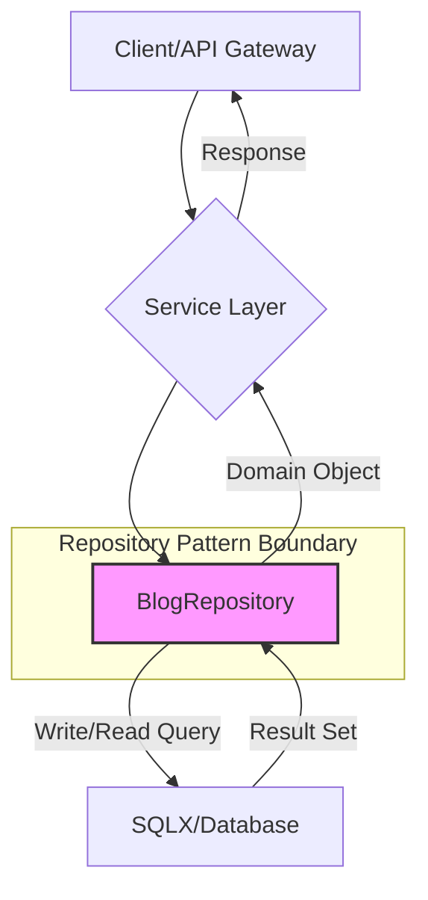

[⬅ Return to Main Compendium](../../README.md)

# Blog Repository Implementation

This document details the `BlogRepository` component, which is responsible for handling all data persistence operations related to blog posts within the application. It implements the Repository pattern to abstract the database logic away from the business layer.

***

## 📚 Overview

The `BlogRepository` struct provides methods for performing standard CRUD (Create, Read, Update, Delete) operations on blog entries. It utilizes the `sqlx` library to interact with the SQL database. A key focus of this implementation is enforcing data integrity and implementing basic authorization checks to ensure users can only modify or delete content they own.

**Files Covered:** `repository/blog_repository.go`

**Dependencies:**
*   `database/sqlx` (Database connection handling)
*   `github.com/google/uuid` (Handling unique identifiers)
*   `asklocal/internal/domain` (Application domain models)

## 📐 Detail

### 🏗️ Structure

The repository is initialized with an existing `*sqlx.DB` connection instance.

```go
type BlogRepository struct {
	DB *sqlx.DB
}

func NewBlogRepository(db *sqlx.DB) *BlogRepository {
	return &BlogRepository{DB: db}
}
```

### 📄 Functionality Breakdown

| Method | Purpose | SQL Operations | Input/Output | Notes |
| :--- | :--- | :--- | :--- | :--- |
| `Create` | Inserts a brand new blog post record. | `INSERT` | `(blog *domain.Blog) -> error` | Uses named parameters (`NamedExec`) for safety. |
| `GetByID` | Fetches a blog post by its UUID, joining author details. | `SELECT` (JOIN) | `(id uuid.UUID) -> (*domain.Blog, error)` | Joins `blogs` with `users` to fetch `author_name` and `author_avatar`. |
| `List` | Retrieves a list of blogs based on dynamic filtering criteria. | `SELECT` (JOIN) | `(filter BlogFilter) -> ([]*domain.Blog, error)` | Implements complex dynamic query construction (WHERE clauses, LIMIT, OFFSET) and ensures pagination/filtering safety. |
| `Update` | Modifies the content, summary, or cover image of an existing blog post. | `UPDATE` | `(blog *domain.Blog) -> error` | **Crucial:** Requires matching `id` and `author_id` to prevent cross-account modification. |
| `Delete` | Removes a blog post permanently. | `DELETE` | `(id uuid.UUID, authorID uuid.UUID) -> error` | **Crucial:** Requires matching `id` and `author_id` for authorization. |

### 🔀 Dynamic Query Logic (`List` function)

The `List` function demonstrates robust dynamic query building:

1.  It initializes a base query with necessary `JOIN`s.
2.  It uses a pattern of appending `AND` clauses, tracking the argument count (`argCount`), and dynamically injecting parameters (`$N`) to the SQL string.
3.  This approach ensures that the SQL query remains parameterized even when multiple optional filters are applied, preventing SQL injection vulnerabilities.

**Example Flow:**
Filter $\rightarrow$ Check parameters $\rightarrow$ Append clause + arg $\rightarrow$ Final execution.

---

## ⚠️ Security and Authorization Warnings (High Priority)

1.  **Write Authorization Enforcement (Critical):** Both the `Update` and `Delete` methods explicitly include `author_id` in the `WHERE` clause. This is a critical security measure ensuring that a user can only modify or delete content belonging to their account. If this check were removed, the application would be vulnerable to unauthorized data tampering.
2.  **Input Validation (Missing):** While the repository enforces authorization, the input `BlogFilter` fields (e.g., `City`, `Country`, `AuthorID`) are assumed to be clean strings. The calling service layer *must* validate these inputs (e.g., ensuring `Limit` and `Offset` are positive integers, and filtering strings do not exceed DB column limits) before they reach this repository layer.
3.  **Data Type Consistency:** The `BlogFilter.AuthorID` is currently treated as a `string` in the filter struct but is compared against `b.author_id` (which is `uuid.UUID` in the domain). This type mismatch must be resolved in the service layer before calling `r.List()` to prevent runtime errors or incorrect filtering.

## 🗒️ Notes and Tech Debt

*   **Transaction Management (Needs Improvement):** For operations involving multiple steps (e.g., updating blog data *and* updating related user statistics/counts), the current implementation executes queries one by one. These operations should be wrapped in a database transaction (`r.DB.Begin()`, `Commit()`, `Rollback()`) to ensure atomicity.
*   **Error Wrapping:** Error handling is basic (`return err`). In a production system, errors should be wrapped using `fmt.Errorf` or a structured logger to provide clear context (e.g., `return fmt.Errorf("failed to delete blog %s: %w", id, err)`).
*   **Pagination Cursor:** For very large datasets, relying solely on `OFFSET` can become inefficient. Consider implementing cursor-based pagination (Keyset Pagination) that uses the last fetched row's timestamp/ID to narrow the next query range, drastically improving performance.

## 💡 Quick Reference & Code Links

*   **[Data Model](domain/blog.go):** (Reference link to the domain struct)
*   **[Service Layer Logic](service/blog_service.go):** (Self-reference: This repository is consumed by the `BlogService` layer.)
*   **[Middleware/Auth Check](middleware/auth.go):** (Links to the authentication logic that supplies the `authorID` used in `Update` and `Delete`.)

## 🖼️ Diagram/Figured Representation

*(A diagram illustrating the flow of data)*

**Figure 1: Data Flow Diagram**

***
***
*Document Generated by Documentation Engineer*
*Last Updated: 2023-10-27*