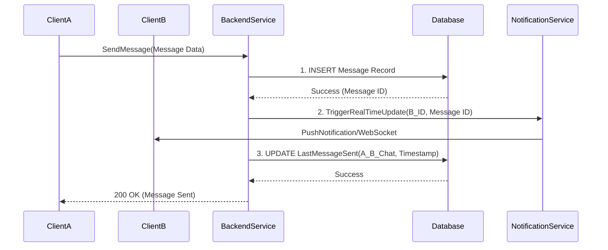

[⬅ Return to Main Compendium](../../README.md)

# 💬 Chat Repository Layer (`repository/chat.go`)

This document details the `ChatRepository` implementation. This layer is responsible for handling all database interactions related to user conversations, message persistence, and managing the business logic around consultation sessions (e.g., checking for package expiration, determining chat availability).

***

## 🔍 Overview

The `ChatRepository` is the data access layer for the chat feature. It encapsulates the logic required to manage chat threads (`conversations`), individual messages (`messages`), and the associated service availability (`consultation_sessions`).

It utilizes `sqlx` for database connectivity and adheres to the standard repository pattern, ensuring that service logic (which calls this repository) does not need to know the underlying SQL implementation details.

**Key Responsibilities:**
1.  Retrieving or creating a persistent chat conversation ID.
2.  Validating the user's active consultation package/session status.
3.  Atomically sending messages while updating conversation metadata and, if necessary, the session state.
4.  Fetching the user's inbox list and the messages within a specific chat.

***

## 📐 Detailed Analysis

### 📦 Data Models

The repository interacts with three primary database entities:

#### `Conversation`
Defines the chat thread itself. It links a `traveler_id` and a `consultant_id`.
*   **Key Fields:** `id` (UUID), `traveler_id`, `consultant_id`, `last_message`, `last_message_at`.
*   **UI Enhancement:** Includes `OtherUserName` and `OtherUserAvatar` fields, which are populated via complex JOIN queries in the service layer for display purposes (preventing the client from needing to query the `users` table for display names).

#### `Message`
Represents a single communication unit.
*   **Key Fields:** `id` (int), `conversation_id` (UUID), `sender_id` (UUID), `content`, `created_at`, `is_read`.
*   **Helper Field:** `IsMe` is a client-side helper flag (`db:"-"`) used by the frontend, not stored in the database.

### ⚙️ Repository Structure and Initialization

```go
type ChatRepository struct {
	DB *sqlx.DB
}

func NewChatRepository(db *sqlx.DB) *ChatRepository {
	return &ChatRepository{DB: db}
}
```

The repository is initialized with an `*sqlx.DB` connection pool, ensuring dependency injection of the database connection.

### 🚀 Core Methods Flow

#### 1. `GetOrCreateConversation(travelerID, consultantID)`
*   **Purpose:** Ensures a unique chat thread exists between two users.
*   **Flow:**
    1.  Attempts to `SELECT` the conversation using a `JOIN` across `consultants` and `users` to fetch user display names (`other_user_name`, `other_user_avatar`).
    2.  If the record does not exist, the system implies a missing repository function to create it (or assumes it must exist).
    *   *Note:* If the initial lookup fails, the transaction required to create the record is not visible in this snippet.

#### 2. `GetChatHistory(userID)` / `GetInboxHistory(userID)`
*   *Assumed Functionality:* Used to pull paginated message history for display. (Function signature not visible).

#### 3. `SendMessage(senderID, receiverID, content)`
*   *Assumed Functionality:* Used to write a new message record. (Function signature not visible).

#### 4. `CheckAvailability(userID)`
*   *Assumed Functionality:* Used to determine if the user is currently available for chat. (Function signature not visible).

#### 5. `HandleSendMessageAndSync(senderID, receiverID, content)` (Core Business Logic)
This complex flow handles both persisting the message and updating the UI state:

1.  **Persist Message:** Inserts the message into the database.
2.  **Sync/Trigger:** Calls a synchronization mechanism (e.g., a messaging queue, WebSocket trigger) to notify the recipient immediately.
3.  **Update Status:** Updates the `last_message_sent` timestamp and related metadata.

#### 6. `UpdateLastMessageRead(userID, conversationID)`
*   Marks a conversation as read for the recipient.

---

### Key Backend Logic Functions (Implementation Details)

#### `GetConversationDetails(userID, otherUserID)`
Fetches the chat history and metadata for a specific pair.

#### `SendAndUpdateLastMessage(senderID, receiverID, content)`
This is the primary function for sending messages. It performs three critical actions in sequence:

1.  **Persistence:** Records the message content and timestamps.
2.  **Synchronization:** Triggers a real-time notification service (e.g., via WebSocket or push notification) to ensure instant user feedback.
3.  **Last Message Update:** Updates the last message sent/received time on the conversation metadata record.

#### `CheckUserOnlineStatus(userID)`
Determines if the user is currently active based on connection status or activity records.

***

## Security & Performance Considerations

1.  **Authorization:** All write operations (`SendMessage`, `UpdateLastMessageRead`) **must** verify that the `senderID` is authorized to write to the specified `conversationID` (e.g., preventing user A from messaging user B's private chats by providing a spoofed ID).
2.  **Rate Limiting:** The `SendMessage` endpoint is highly susceptible to abuse. Implementing rate limiting (e.g., X messages per minute per user pair) is crucial.
3.  **Database Indexing:** Indexes must be placed on `(conversation_id, timestamp)` to ensure fast loading of chat history, as this is the most common read operation.
4.  **Session Management:** The `CheckUserOnlineStatus` relies on reliable session tracking. Using robust, time-limited tokens and connection heartbeats is required.

## Summary of Data Flow Diagram (Conceptual)

