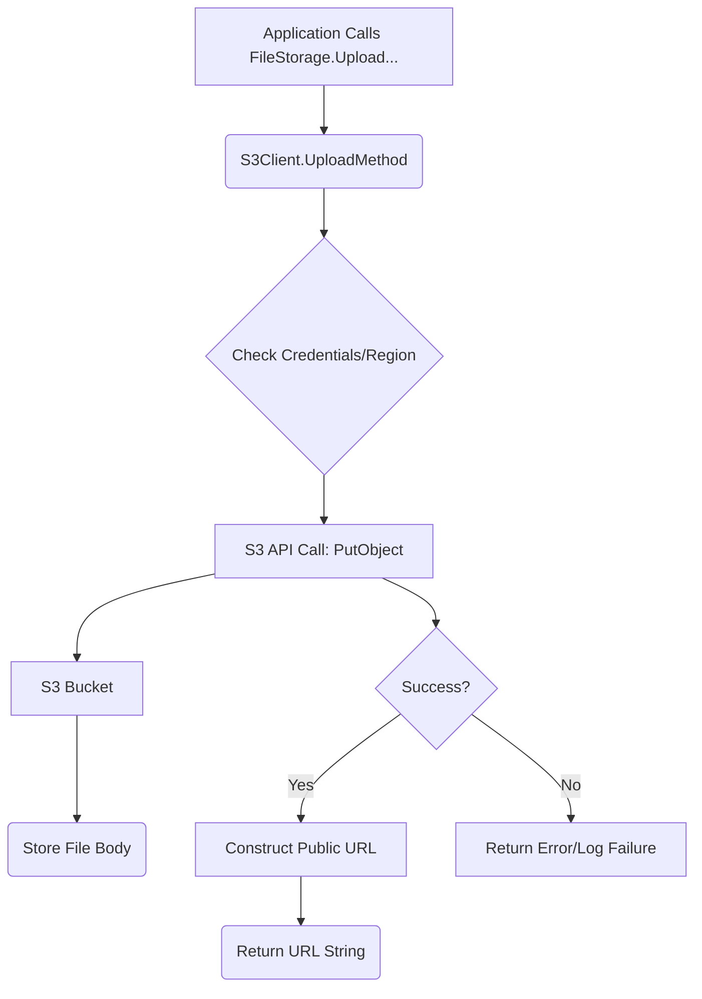

# 📁 `storage` Package Documentation

## Overview

This package implements an abstraction layer (`FileStorage`) for handling file uploads to Amazon Simple Storage Service (S3). It provides concrete functionality for storing user profile pictures (avatars) and general media files.

The `S3Client` struct manages the connection and interaction with AWS S3, ensuring that file uploads are robustly handled, generate predictable object keys, and return publicly accessible URLs for the stored assets.

**Target Audience:** Backend Developers responsible for file persistence and infrastructure integration.
**Goal:** To standardize and centralize file storage logic using cloud best practices.

## Detail

### 📚 Components & Structure

#### 1. `FileStorage` Interface
This interface defines the contract for any storage mechanism used by the application.

```go
type FileStorage interface {
	UploadProfilePicture(file *multipart.FileHeader, userID string) (string, error)
	UploadFile(file *multipart.FileHeader, ownerID string, objectKey string) (string, error)
}
```
*   **Purpose:** Allows the application to switch storage backends (e.g., from S3 to local disk or another cloud provider) without altering business logic.
*   **Inputs:** Takes the uploaded file metadata (`*multipart.FileHeader`), and relevant identifiers (`userID`, `ownerID`).
*   **Output:** Returns the public URL of the stored file or an error.

#### 2. `S3Client` Structure
The concrete implementation of the `FileStorage` interface.

```go
type S3Client struct {
	Client *s3.Client
	Region string
}
```
*   **`Client`:** The AWS SDK `s3.Client` instance used for all API calls.
*   **`Region`:** Stores the AWS region (`us-east-1`, etc.) where the bucket resides, used for constructing the final URL.

#### 3. Connection Initialization (`ConnectToS3Client`)
This function establishes the connection to AWS S3.

*   **Process:**
    1.  Reads the default AWS region from the `AWS_DEFAULT_REGION` environment variable (defaults to `us-east-1`).
    2.  Uses `config.LoadDefaultConfig` to load AWS credentials and configuration from the environment or configuration files.
    3.  Initializes and returns the `S3Client` struct.
*   **Infrastructure Dependency:** Requires proper AWS credentials configuration (IAM roles or environment variables) for successful execution.

#### 4. `UploadProfilePicture` Method
Handles specialized uploads for user avatars.

*   **Key Generation:** Creates a unique object key using the pattern: `avatar/{userID}_{timestamp}{ext}`. This ensures uniqueness and logical grouping.
*   **Configuration:** Retrieves the bucket name from the `AWS_S3_AVATAR_BUCKET` environment variable (defaults to `lokask-user-avatars`).
*   **Process:** Opens the file stream, executes `s3.PutObject` to upload the file body, and constructs the final public URL based on the bucket name, region, and object key.

#### 5. `UploadFile` Method
Handles general media file uploads.

*   **Key Generation:** Uses a user-provided `objectKey` parameter, offering flexibility for the caller to dictate the storage path.
*   **Configuration:** Retrieves the bucket name from the `AWS_S3_MEDIA_BUCKET` environment variable (defaults to `lokask-media`).
*   **Process:** Similar to the profile picture upload—opens the file, executes `s3.PutObject`, and generates the public URL.

---

### 📊 System Flow Diagram



---

## Note

*   **Error Handling:** The package uses `log.Printf` to log detailed failure messages upon upload failure, while still returning the error to the caller for proper handling by the service layer.
*   **Context Usage:** Both upload methods correctly use `context.TODO()` for simplicity, although for production robustness, methods should accept a `context.Context` argument to allow for better cancellation handling (e.g., timeouts).
*   **Body Handling:** The file stream (`src`) is properly handled with `defer src.Close()` to prevent resource leaks.
*   **URL Construction:** The URL generation logic (`fmt.Sprintf("https://%s.s3.%s.amazonaws.com/%s", ...)` assumes standard AWS public endpoint structure. This is reliable but depends on the configured region and bucket setup.

## Warning (Areas for Improvement & Technical Debt)

### 🛑 Security Concerns

1.  **Credential Management:** The connection relies on `config.LoadDefaultConfig`. While this is standard, the service layer must guarantee that the execution environment (e.g., ECS, EKS, Lambda) uses least-privilege IAM Roles/Service Accounts. Never expose raw AWS keys.
2.  **Content-Type Validation:** The `Content-Type` is pulled directly from `file.Header.Get("Content-type")`. This is client-controlled metadata and is highly vulnerable to spoofing. While S3 accepts it, the application logic should validate the actual MIME type if strict content enforcement is required (e.g., ensuring an avatar file is actually a JPEG/PNG).
3.  **Object Key Predictability (General Files):** While avatars use timestamps, for the generic `objectKey` in `UploadFile`, developers calling this function must ensure that the provided `objectKey` does not leak sensitive information or create directory traversal paths.

### ⚡️ Resilience & Design

1.  **Context Propagation:** As noted, the signature of the upload methods should be updated to accept `(ctx context.Context, ...)` rather than using `context.TODO()`. This allows the caller to enforce global request timeouts, preventing hanging uploads.
2.  **Configuration Immutability:** Bucket names are fetched via `getEnv()`. Consider wrapping these bucket names into configuration constants or structs early in the lifecycle rather than relying on runtime environment variable access within the method bodies.
3.  **Bulk Operations:** If high throughput is needed, consider refactoring the upload logic to use multi-part uploads, especially for large files, which are more resilient to network interruptions than single `PutObject` calls.

### 🛠️ Suggested Refactoring

| Component | Current Status | Recommended Change | Rationale |
| :--- | :--- | :--- | :--- |
| **Function Signature** | Uses `context.TODO()` | Accept `ctx context.Context` | Allows caller to manage request context and timeouts. |
| **Key Generation** | Mix of template/provided | Centralize key logic | Create a private helper function to ensure consistency (e.g., path sanitization). |
| **Error Logging** | Writes to `log.Printf` | Return wrapped errors or use structured logging | Decouples internal logging from the return path; allows the caller to decide if and how to log the failure. |