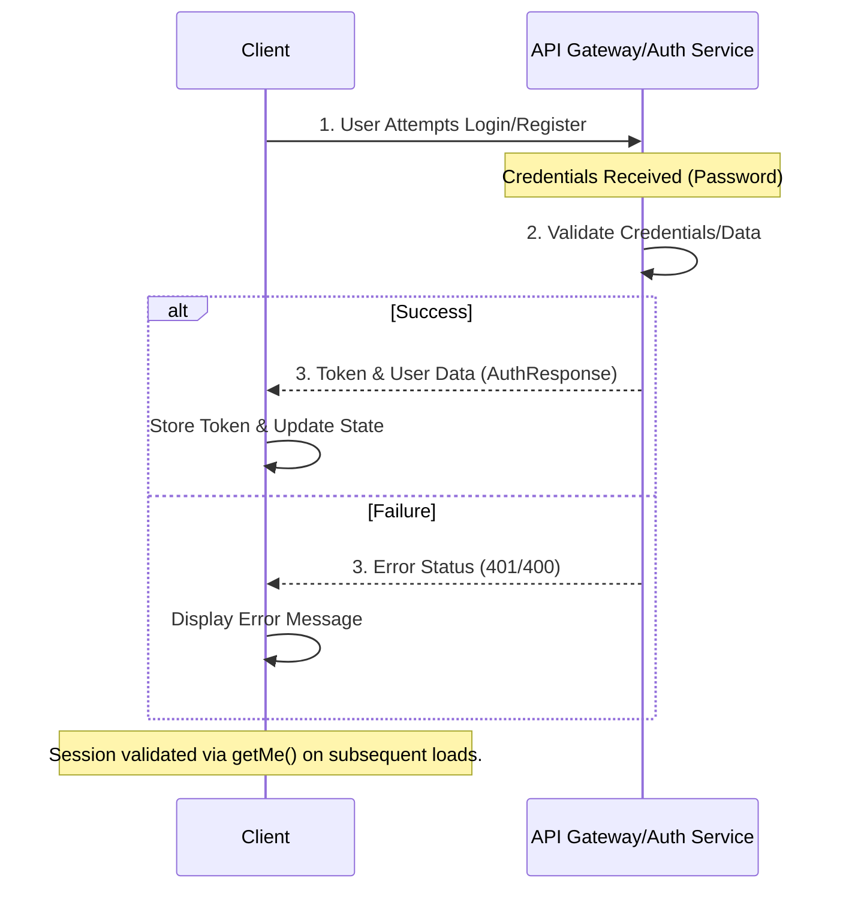

# 🔐 Authentication Service Client Layer Documentation

**Module:** `auth-service-client`
**Version:** 1.0
**Author:** Documentation Engineering Team
**Knowledge Area:** Security, System Design, API Integration

## 📜 Overview

This module provides the client-side abstraction layer for handling all user authentication workflows, including traveler and consultant registration, user login, and session validation. It encapsulates direct API communication, ensuring that higher-level components interact with a predictable and strongly-typed interface, thereby enhancing maintainability and improving the security posture of the application.

The primary function is to abstract the network layer using a generalized `fetchJson` utility, ensuring consistent handling of request body serialization and response type casting.

---

## 🔍 Technical Detail

### 1. Data Structures (Interfaces)

| Interface | Description | Key Fields | Security Consideration |
| :--- | :--- | :--- | :--- |
| `RegisterData` | Basic credentials required for any new user account. | `fullName`, `email`, `password` | Password hashing/transmission handled by the backend. |
| `RegisterConsultantData` | Credentials plus location data specific to consultants. | Inherits `RegisterData`, adds `city` | Ensures proper regional context upon registration. |
| `LoginData` | Minimal data required for authentication. | `email`, `password` | Used only for credential exchange. |
| `AuthResponse` | The successful response payload after authentication. | `token` (JWT), `user` (details), `role` | Contains the session token and user context. |

### 2. API Functions

All functions utilize `fetchJson<T>(endpoint: string, config: FetchConfig)` which abstracts network requests.

#### 🟢 User Registration Endpoints (`POST /api/v1/auth/register`)

1.  **`registerTraveller(data: RegisterData)`**
    *   **Purpose:** Registers a standard traveler user.
    *   **Method:** `POST`
    *   **Endpoint:** `/auth/register`
    *   **Payload:** `full_name`, `email`, `password`, `role: "traveler"`
    *   **Output:** `AuthResponse`

2.  **`registerConsultant(data: RegisterConsultantData)`**
    *   **Purpose:** Registers a professional consultant user.
    *   **Method:** `POST`
    *   **Endpoint:** `/auth/register`
    *   **Payload:** `full_name`, `email`, `password`, `city`, `role: "consultant"`
    *   **Output:** `AuthResponse`

#### 🟢 Authentication Endpoints

3.  **`login(data: LoginData)`**
    *   **Purpose:** Authenticates an existing user and obtains a session token.
    *   **Method:** `POST`
    *   **Endpoint:** `/auth/login`
    *   **Payload:** `email`, `password`
    *   **Output:** `AuthResponse`

4.  **`getMe()`**
    *   **Purpose:** Validates the current user's session (e.g., on page load or tab focus change).
    *   **Method:** `GET`
    *   **Endpoint:** `/auth/me`
    *   **Payload:** None
    *   **Output:** `AuthResponse` (Returns only user details if token is present, or an error if stale).

***

### Conceptual Flow Diagram: User Authentication Workflow

The following diagram illustrates the lifecycle of authentication processes using this module.

---

## 📝 Operational Notes

*   **Session Management:** The `getMe()` function is critical for maintaining perceived session continuity across application lifecycle events (e.g., refreshing the browser or background tab switching). It allows the client to proactively check token validity.
*   **Data Integrity:** The explicit separation of `RegisterTravellerData` and `RegisterConsultantData` enforces data typing at the client level, preventing incorrect payload submissions based on the user type.
*   **Error Handling Flow:** When implementing consuming components, always wrap calls to `fetchJson` in robust `try...catch` blocks. Since this module abstracts the network layer, it assumes that network failure or API-level errors (e.g., "User already exists") will be handled by the underlying `fetchJson` wrapper and should be caught gracefully.

---

## ⚠️ Security & Engineering Warnings (To Be Resolved)

### 1. State and Token Handling (High Priority)
This module successfully fetches the `token`, but the component consuming this module *must* implement secure local storage (e.g., HttpOnly cookies or secure in-memory state management) to prevent XSS/CSRF vulnerabilities. **The module itself does not handle token persistence or secure deletion.**

### 2. Comprehensive Error Handling (High Priority)
The current function definitions assume a successful API call. **There is no documented handling for specific API failure codes** (e.g., 401 Unauthorized, 403 Forbidden, 422 Unprocessable Entity). Consumers must be warned that these functions will throw exceptions on API failure, and custom logic must interpret the error body returned by `fetchJson` to provide meaningful feedback (e.g., distinguishing between "Bad Password" and "Email Not Found").

### 3. Rate Limiting Implementation (Medium Priority)
Client-side throttling or an integrated retry mechanism is highly recommended for `login` and `register` calls to prevent brute-force attacks and excessive API usage. This defensive logic should be considered before deployment.