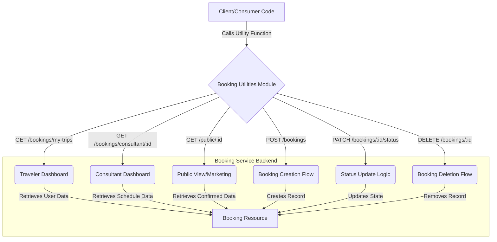

# 🗓️ Booking Service API Utilities

This document provides a comprehensive guide and reference for the utility functions used to interact with the Booking Service API. These functions encapsulate common REST API calls related to creating, viewing, updating, and deleting booking records, ensuring type safety and consistent network interaction logic.

## 📂 Overview

The `booking` utility module acts as a centralized client layer for handling interactions with the primary `/bookings` resource endpoint. It abstracts away the low-level HTTP request details (like JSON serialization, method handling, and base URL structure), allowing consumer code to focus purely on the business logic (e.g., fetching a user's trips or updating a booking status).

The module supports multiple distinct use cases within the organization's ecosystem:
1.  **Booking Creation:** Submitting a new booking request.
2.  **User/Role-Based Retrieval:** Fetching booking lists for specific roles (e.g., Traveler, Consultant, Public view).
3.  **Modification:** Patching the status or fully deleting a booking record.

## 🔍 Detail

The following table details each function, its purpose, required parameters, and the expected API interaction.

### Function Reference

| Function Name | Description | Endpoint/Method | Parameters | Return Type |
| :--- | :--- | :--- | :--- | :--- |
| `createBooking` | Creates a new booking record via a POST request. | `POST /bookings` | `data: CreateBookingRequest` | `Promise<Booking>` |
| `getMyTrips` | Retrieves all bookings associated with the currently logged-in user (Traveler view). | `GET /bookings/my-trips` | `userId: string` (Used for context, but API handles context) | `Promise<Booking[]>` |
| `getConsultantBookings` | Retrieves all bookings scheduled for a specific consultant. | `GET /bookings/consultant/:id` | `consultantId: string` | `Promise<Booking[]>` |
| `getPublicConsultantBookings` | Retrieves confirmed bookings for a consultant viewable by the public (unauthenticated). | `GET /public/:id` | `consultantId: string` | `Promise<Booking[]>` |
| `updateBookingStatus` | Updates the status of a booking (e.g., `confirmed`, `cancelled`). | `PATCH /bookings/:id/status` | `id: string`, `status: "confirmed" \| "cancelled"` | `Promise<Booking>` |
| `deleteBooking` | Permanently deletes a specified booking record. | `DELETE /bookings/:id` | `id: string` | `Promise<void>` |

### Code Structure Analysis

The implementation relies on a helper function, `fetchJson`, which standardizes the API communication:

```typescript
// Concept of the underlying fetch wrapper
fetchJson<T>(url: string, options?: { method: string, body: string }): Promise<T>
```

This abstraction ensures consistency in error handling, JSON parsing, and request execution across all endpoints.

## 🖼️ System Flow Diagram (Conceptual Figure)

The following diagram illustrates how the different roles interact with the central booking resource via the utility layer.



## ⚠️ Warning: Security and Authorization

1.  **Unauthorized Access:** The `getPublicConsultantBookings` endpoint explicitly states it does *not* require authentication. Consumers must ensure that the data exposed via this public endpoint is restricted only to non-sensitive, confirmed booking information.
2.  **Privilege Escalation:** The `deleteBooking` function uses a `DELETE` request, which is a highly destructive operation. Ensure that the calling scope has appropriate backend authorization checks (e.g., only administrators or the original creator can perform this action).
3.  **Status Dependency:** When using `updateBookingStatus`, the client must validate that the requested `status` is valid for the given booking state. The backend must enforce a state machine transition logic to prevent illegal status changes.

## 📝 Note: Development Considerations

*   **Error Handling:** While the provided code uses `fetchJson`, consuming modules should implement robust `try...catch` blocks around all API calls to gracefully handle network failures or 4xx/5xx HTTP errors returned by the backend.
*   **Client-Side State:** When handling fetching trips (`getMyTrips`), remember that the API returns an array of `Booking` objects. Consumers should manage the loading state and error state in the client component to provide a good user experience.
*   **Idempotency:** The `updateBookingStatus` and `deleteBooking` calls should be treated as idempotent from a consumer perspective where possible, meaning running the call multiple times with the same input should not lead to unintended side effects (though the underlying system logic must support this).