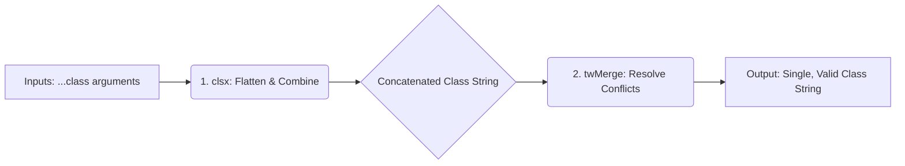

# 📘 Component Utility: `cn` (Class Name Merger)

## 🚀 Overview

This module provides a utility function, `cn`, designed to safely and reliably merge multiple class names into a single, conflict-free string. It is a critical component of any modern, utility-first design system utilizing Tailwind CSS.

The function addresses a common pain point in frontend development: when multiple utilities (e.g., `p-4`, `bg-red-500`, `hover:p-6`) are combined, they can conflict (e.g., two utilities defining padding or color). The `cn` function ensures that conflicts are resolved correctly, allowing the intended styles (usually the most specific or last defined style) to take precedence.

* **Type:** Utility Function
* **Purpose:** Robust, conflict-aware class name concatenation.
* **Dependencies:** `clsx` and `tailwind-merge`.

---

## 🛠️ Detail and Mechanics

The `cn` function is a wrapper around two powerful utilities: `clsx` and `tailwind-merge`. Understanding their roles is key to understanding the function's robust nature.

### 1. Execution Flow

The function processes the input classes in two sequential steps:

1.  **Concatenation (`clsx`):**
    *   The function first calls `clsx(inputs)`. The `clsx` library handles variable arguments, allowing developers to pass strings, arrays, and even conditional objects (e.g., `{ 'active': isActive }`). It efficiently flattens and combines these arguments into a single, clean string of class names.
2.  **Conflict Resolution (`twMerge`):**
    *   The resulting string from `clsx` is then passed to `twMerge()`. This utility reads the generated string and applies specific logic tailored to Tailwind CSS rules. If conflicting properties are found (e.g., the string contains both `p-4` and `p-8`), `twMerge` intelligently discards the redundant or incorrect utility, ensuring the correct value (`p-8`) remains.

### 2. Technical Implementation

```typescript
// Core logic:
return twMerge(clsx(inputs));
```

| Dependency | Role | Function |
| :--- | :--- | :--- |
| `clsx` | **Input Handler** | Takes mixed inputs (strings, arrays, objects) and compiles them into one single, valid class string. |
| `tailwind-merge` | **Conflict Solver** | Analyzes the concatenated string and resolves conflicts, ensuring Tailwind's utility precedence rules are enforced. |
| `cn` | **Wrapper** | Provides the simple, exportable API for developer consumption. |

### 🖼️ Conceptual Data Flow



---

## 💡 Usage Notes (Development Guidelines)

*   **Prefer `cn` over manual concatenation:** Always use `cn(...)` when combining classes that might overlap (e.g., combining a fixed size with a responsive size).
*   **Conditional Logic:** This function excels with conditional classes. Instead of needing separate functions like `classNameA || classNameB`, use the object syntax supported by `clsx`:
    ```typescript
    cn("base-style", {
      'is-large': size === 'lg',
      'is-active': isActive
    })
    ```
*   **Context:** This utility assumes the consuming environment is using Tailwind CSS. If the project switches to a different CSS framework, this dependency (`twMerge`) would need replacement.

---

## ⚠️ Security and Stability Warnings

*   **Dependency Management:** This utility relies heavily on the correct versions of `clsx` and `tailwind-merge`. Ensure these packages are consistently installed across development, staging, and production environments to prevent subtle display bugs.
*   **Input Sanitization (Minimal Concern):** While `clsx` handles the array and object structures, developers should treat the inputs as controlled data. Never pass raw, unvalidated user input directly into the `cn` function in a manner that bypasses component-level controls, as this could potentially lead to styling vulnerabilities (though the utility itself is highly protective).
*   **Performance:** The overhead of running `twMerge` is minimal and optimized for runtime use. Performance issues are highly unlikely unless the function is called thousands of times within a single render loop.
*   **Circular Dependencies:** Be mindful of how component props are passed. If classes are derived from deeply nested component states, ensure the state management does not introduce circular class dependency logic.