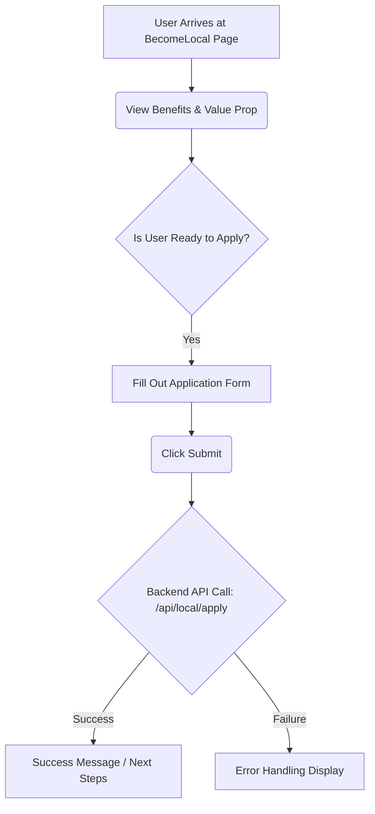

[⬅ Return to Main Compendium](../../README.md)

# 🗺️ BecomeLocal Component Documentation

This module handles the user journey for individuals wishing to join the platform as a local expert. It provides motivation (benefits) and the necessary application form.

---

## 📚 Overview

The `BecomeLocal` component is a critical frontend module designed to onboard community members who possess deep local knowledge but do not meet the criteria of a traditional tour guide.

The component aims to:
1. Clearly articulate the advantages of joining the platform (e.g., earning money, flexibility).
2. Guide users through a simple application form to capture essential local expertise details.

The component is styled using a modern, card-based layout, ensuring a clean and persuasive user experience.

## 🔍 Detail Analysis

### Component Structure
The component is a self-contained functional React component (`BecomeLocal`).

**Key Sections:**

1. **Hero/Header:** Displays the main headline ("Become a local on Lokask") and a supporting paragraph emphasizing that formal tour guide licensing is *not* required.
2. **Benefits Display:** A list of benefits using animated checkmarks. This section is highly persuasive and highlights the value proposition.
3. **Application Form:** The core functionality. It collects standard registration details (Name, Email) along with localized information (City, Expertise).

### Logic Flow

1. **Benefits Presentation:** Iterates over a predefined `benefits` array to map and render list items.
2. **Form Handling:** The form collects data for:
    *   Name (Text)
    *   Email (Email format)
    *   City of Residence (Text)
    *   Local Expertise (Textarea)
3. **Submission:** On submission, the form data is presumably handled by a parent component or an integrated API call (though the submission logic itself is placeholder/client-side in the current code).

### UI/UX Decisions
*   **Accessibility:** Uses clear labels (`htmlFor`) and standard input fields.
*   **Focus:** The design is mobile-first (using `grid-cols-1` fallback on smaller screens).
*   **Fixes Applied:** The component explicitly mentions removing the Navbar and Footer, suggesting these components are managed outside or in a parent layout wrapper.

#### 🌐 Conceptual Flow Diagram (Figure: Become Local Journey)

*(Figure Note: A visual flow chart would be placed here showing: Landing Page -> BecomeLocal Component -> Benefit Awareness -> Form Submission -> [Backend: Validation/API Call] -> Confirmation/Onboarding)*

## 📝 Notes & Recommendations

*   **Client-Side Validation:** Although the component structure is solid, implementing robust client-side validation (e.g., checking if the "Expertise" field is empty, or if the email format is valid) should be added before submission.
*   **Post-Submission State:** After successful submission, the user experience should guide them immediately. Suggestions include:
    *   Displaying a "Thank You" screen with an expected timeline (e.g., "We will review your application within 48 hours.").
    *   Redirecting them to an FAQ or community portal page.
*   **Scalability:** If the platform expands, considering separating the `benefits` array into a dedicated constants file or a content management system (CMS) feed would improve maintainability.

## ⚠️ Warnings & Tech Debt

1. **Missing Submission Handler:** The provided code includes a form but lacks the actual submission handler logic (the `onSubmit` function on the `<form>` tag). This is critical functionality that must be implemented.
2. **API Integration Point:** The component needs a dedicated service or hook (e.g., `useApplyLocal`) to manage the asynchronous call to the backend endpoint responsible for saving the local profile data.
3. **Input State Management:** Currently, the input fields are uncontrolled. They should be integrated with React state management (e.g., `useState` or a form library like React Hook Form) to maintain data integrity during typing and validation.
4. **Security:** When designing the backend validation (referenced by the form data), ensure that input sanitization is performed on *all* text inputs, especially the `expertise` field, to prevent XSS attacks.

***

### 🔗 Related Modules & Links

| Feature/File | Description | Reference Link |
| :--- | :--- | :--- |
| **Authentication** | Handles user sign-up and login, which is required before an application can be processed. | `../components/auth/SignInForm.tsx` |
| **Backend API** | The endpoint that must receive and process the application payload. | `[API Endpoint Reference](../api/local/apply)` |
| **UX/Flow Logic** | The primary component responsible for navigating the user *to* this page. | `../../pages/homepage/HomePage.tsx` |
| **Validation Logic** | Utility functions for validating emails and required fields. | `../utils/validation/validator.ts` |