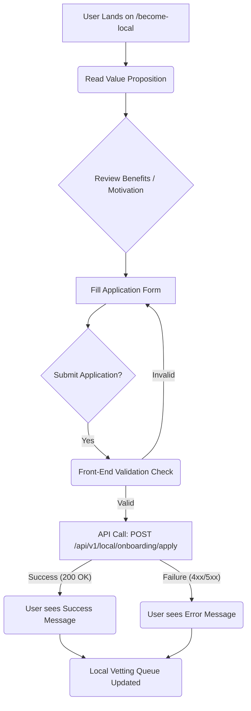

# Lokask Feature Documentation: Become Local Onboarding Component

This document provides a comprehensive technical and structural review of the `BecomeLocal` React component. This component is designed to onboard users who are "local experts" and wish to contribute knowledge and services to the Lokask platform without needing official tour guide certifications.

---

## 📊 Overview

The `BecomeLocal` component serves as a critical User Acquisition funnel endpoint. Its primary purpose is to convert general website visitors into registered local contributors (suppliers of localized knowledge). The structure is designed to be highly persuasive, first establishing the value proposition (the *Why*), then detailing the benefits (the *What*), and finally capturing the required user data (the *How*).

**Key Function:** Local Knowledge Contributor Registration/Application.
**Target Audience:** Residents of cities who are knowledgeable about their local area but are not professional tour guides.
**Business Goal:** Increase the supply of local content and guide services on the Lokask platform.

## 💻 Detailed Component Analysis

### 1. Component Structure & UI Flow

The component is a self-contained React functional component using modern UI libraries (e.g., `lucide-react`) and utility CSS (Tailwind CSS).

| Section | Purpose | Data/Elements | Implementation Status |
| :--- | :--- | :--- | :--- |
| **Hero/Header** | Establishes value and context. | Headline: "Become a local on Lokask". Subtext: Explains the non-licensing requirement. | Complete (UI/UX). |
| **Benefits Grid** | Motivates user action by detailing benefits. | Hardcoded array of 5 benefits (e.g., "Earn money from your expertise," "No tour guide license required"). | Complete (Static Content). |
| **Application Form** | Captures primary lead data. | **Fields:** Name (text), Email (email), City (text), Expertise (textarea). **Action:** Submit Button. | Complete (Front-end structure). |

### 2. Technical Implementation Notes

*   **Styling:** Utilizes a semantic color palette (e.g., `primary`, `muted-foreground`) and spacing classes, indicating adherence to a design system.
*   **Reusability:** The `benefits` list is defined as a constant array, making it easily maintainable for content updates.
*   **Form State Management:** Currently, the form inputs are uncontrolled (they lack `useState` hooks and `onChange` handlers).

### 3. System Design Considerations (System/Infrastructure)

From a system design perspective, the introduction of this component necessitates the following infrastructure planning:

1.  **API Endpoint Definition:** A dedicated, secure, and scalable endpoint is required to handle the submission.
    *   **Method:** `POST`
    *   **Endpoint Example:** `/api/v1/local/onboarding/apply`
    *   **Payload (Request Body):** `{ name: string, email: string, city: string, expertise: string }`
2.  **Validation Layer:** Robust server-side validation is mandatory for all fields (especially email format and non-empty strings).
3.  **Workflow Trigger:** Successful submission should trigger a workflow in the CRM/User Management System:
    *   User record creation (Pending Status).
    *   Automated confirmation email dispatch.
    *   Assignment of a review task to the "Local Vetting" team queue.

***

## 📌 Documentation Notes

*   **Accessibility (A11y):** While standard labels are used, ensure that focus states (`focus:ring-2`, etc.) are fully functional and tested across keyboard navigation.
*   **SEO Optimization:** The Hero section text should be reviewed to ensure the primary keywords (e.g., "local guide," "local knowledge," "Lokask") are optimized for search engine visibility.
*   **Scalability:** The component is currently designed for a single, fixed application flow. If the system expands to handle different types of local expertise (e.g., food guides, history experts), the `expertise` field should potentially be augmented with structured, multi-select tags instead of a simple `textarea`.

## ⚠️ Warning (Critical Action Items / Unfinished Work)

**The most critical missing piece is the actual form submission logic.**

The component includes a button and a form structure, but the `onSubmit` handler is not implemented. The following tasks *must* be completed before deployment:

1.  **Form State Management:** Implement `useState` hooks to manage the input values for Name, Email, City, and Expertise.
2.  **Submission Handler:** Implement the `handleSubmit` function. This function must:
    *   Validate all fields locally before submission.
    *   Prevent the default form submission behavior.
    *   Call the defined backend API endpoint (`POST /api/v1/local/onboarding/apply`).
3.  **User Feedback Loop:** The component must handle API response states:
    *   **Success:** Display a success message (e.g., "Thank you! We will review your application.") and reset the form.
    *   **Error:** Display actionable error messages (e.g., "Please enter a valid email address," or "Server error, please try again later.").

---

## 🖼️ Generated Figured (Conceptual Flowchart)

The following figure illustrates the intended user flow and the backend integration points.

