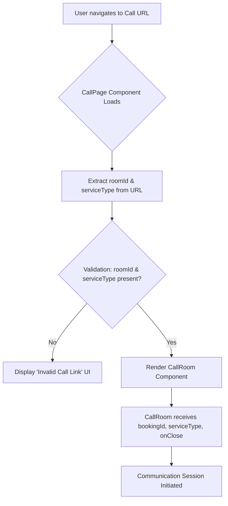

# 📞 Call Page Component Documentation

## Overview

The `CallPage` component serves as the entry point for initiating a scheduled communication session (either video or voice) within the application. It is responsible for extracting necessary parameters from the URL, specifically the `roomId` (a unique identifier for the booking) and the `serviceType` (indicating whether the call is video or voice). It validates these parameters and, upon successful validation, renders the dedicated `CallRoom` component, passing all required context and handling the window closure mechanism.

This component is crucial for the initial loading sequence and state management of the real-time communication system.

## Detail

### Component Details

*   **Component Name:** `CallPage`
*   **Framework:** React (Next.js/React Router Context)
*   **Dependencies:**
    *   `react-router-dom` (`useParams`, `useSearchParams`): Used for accessing dynamic URL parameters.
    *   `@/components/CallRoom`: The primary view component that handles the actual call logic and UI.

### State & Input Handling

1.  **Parameter Extraction:**
    *   `roomId`: Retrieved from the URL parameters (`useParams()`). This acts as the primary key for the session.
    *   `serviceType`: Retrieved from the URL search parameters (`useSearchParams()`). It must be one of two literal types: `"video_call"` or `"voice_call"`.

2.  **Validation Logic:**
    *   The component immediately checks if both `roomId` and `serviceType` are present.
    *   If either parameter is missing, the component renders a dedicated "Invalid Call Link" UI screen, preventing the attempt to load the `CallRoom` component.

3.  **Rendering:**
    *   If validation succeeds, the `CallRoom` component is rendered.
    *   Props passed to `CallRoom`:
        *   `bookingId`: The validated `roomId`.
        *   `serviceType`: The validated `serviceType`.
        *   `onClose`: A handler function that executes `window.close()`, ensuring the calling window is dismissed upon completion or exit.

### System Flow Diagram

## Note

### Architectural Considerations

1.  **Client-Side Routing Dependency:** The component relies heavily on the client-side routing provided by `react-router-dom`. Any changes to how `roomId` or `serviceType` are passed in the URL structure will require modifications here.
2.  **Error Handling:** The current error handling is limited to checking for missing parameters. For production robustness, consider implementing more granular error handling, such as catching network failures or unauthorized booking access *within* the `CallRoom` component itself, rather than solely in this wrapper.
3.  **Type Safety:** The usage of `as "video_call" | "voice_call"` provides strong type hinting, which is good practice but assumes the search parameters are trusted by the upstream system.

## Warning

### Critical Development Points

1.  **Security (Authorization):** This component handles the *initiation* of a call but **does not** handle authorization. A calling service/API must validate that the user associated with the currently active session token is authorized to access the `roomId` and execute the requested `serviceType`. Relying solely on the existence of the `roomId` is insufficient for secure operation.
2.  **Session Lifecycles:** The `onClose={() => window.close()}` mechanism assumes a single-purpose pop-up window. Developers must ensure that the session cleanup (e.g., releasing media resources, terminating backend streams) is properly triggered either by the `CallRoom` component or by calling the `onClose` prop before `window.close()` is executed.
3.  **Server/Client Split:** Ensure that the backend API responsible for establishing the communication channel (e.g., WebRTC signaling server) expects and correctly interprets the `serviceType` parameter, as this is critical for configuring media capabilities.