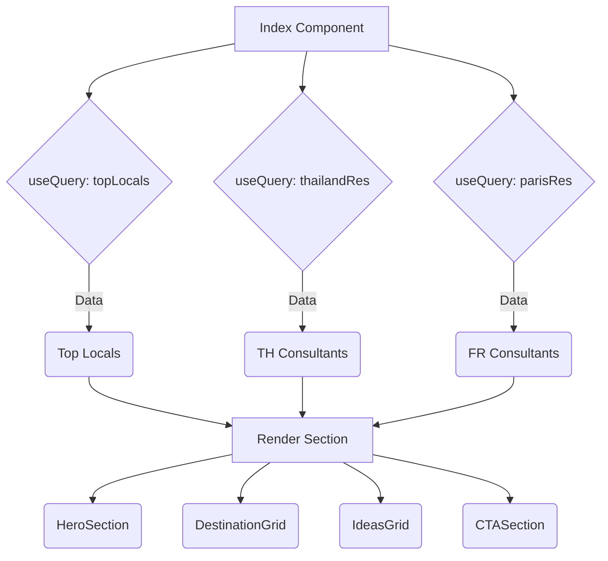

```markdown
[⬅ Return to Main Compendium](../../README.md)

# Landing Page Composition (`Index`)

This component serves as the primary landing page view for the application, composing various specialized sections (Hero, Destinations, Ideas) and fetching initial data loads for key content areas.

---

## 📚 Overview

The `Index` component is the root component for the main public entry point. It utilizes React Query (`@tanstack/react-query`) to asynchronously fetch localized and general consultant data (e.g., top locals, consultants in Thailand, consultants in Paris). It then organizes the resulting content using a modular component composition pattern, ensuring a structured and high-performance initial load experience.

**Domain:** Frontend Presentation Layer / Homepage Composition
**Purpose:** To render the entire landing page while managing the asynchronous fetching of required content data.

## 🔍 Detail

### 🛠️ Component Structure & Logic Flow

1.  **Data Initialization (Data Layer):**
    *   The component initializes three separate queries using `useQuery` from `@tanstack/react-query`. This pattern ensures independent loading states and cache management for different datasets.
    *   **`topLocals`:** Fetches general "top" consultants (`getConsultants()`).
    *   **`thailandRes`:** Fetches consultants filtered specifically for Thailand (`getConsultants({ country: "TH" })`).
    *   **`parisRes`:** Fetches consultants filtered specifically for France/Paris (`getConsultants({ country: "FR" })`).
    *   *Data Usage:* The fetched data is currently stored in `topLocals`, `thailandRes`, and `parisRes` variables, but **it is not utilized in the JSX rendering block.**

2.  **Composition (View Layer):**
    *   The main return block structures the page content using a vertical flex container (`w-full flex flex-col gap-10`).
    *   It renders several dedicated, self-contained components:
        *   `<HeroSection />`: Primary visual introduction.
        *   `<DestinationGrid />`: Displays available destinations.
        *   `<IdeasGrid />`: Shows thematic ideas or content blocks.
        *   `<CTASection />`: Call-to-action section.

### 🔗 Imports & Dependencies

*   **Local Components:**
    *   `HeroSection`
    *   `DestinationGrid`
    *   `LocalsCarousel` (Imported, but not used in the main return JSX)
    *   `IdeasGrid`
    *   `CTASection`
    *   `Footer` (Imported, but not used in the main return JSX)
*   **Hooks/Libraries:**
    *   `useQuery`: State management and asynchronous data fetching.
    *   `getConsultants`: API utility function used for data fetching.

***
### 📐 Code Flow Map (Conceptual)



## 📝 Note (Best Practices & Suggestions)

*   **Loading State Integration:** The current component defines `isLoading` flags for the data queries (`isLoading`, `loadingThai`, `loadingParis`). It is highly recommended that the resulting components (or the main `Index` component) pass these loading states down and display appropriate loading skeletons or placeholders rather than allowing the component to render nothing during the wait time.
*   **Data Injection:** Instead of initializing separate, unlinked queries, consider consolidating the fetching logic if the data sources are related. If `topLocals` is meant to feed `LocalsCarousel`, passing the data prop explicitly would enforce data flow.
*   **Layout Props:** The comment suggests removing `min-h-screen` from the parent container, relying on the parent `Layout` component. This is good practice for modularity and consistency.

## ⚠️ Warning (Critical Review Items & Unfinished Work)

1.  **Unused Data:** The most critical issue is that the three data results (`topLocals`, `thailandRes`, `parisRes`) fetched via `useQuery` are **not consuming the data in the final JSX structure.** The component loads data but displays none of it.
2.  **Unused Imports:** `LocalsCarousel` and `Footer` are imported at the top of the file but are **not rendered** within the main `return` statement. This suggests potential incomplete UI development or forgotten cleanup.
3.  **Error Handling:** The `useQuery` hooks lack explicit `.error` handling (e.g., `const { error } = useQuery(...)`). If the API fails, the user will simply encounter an empty/broken state without clear feedback.

## 🚨 Tech Debt (Refactoring & Future Improvements)

*   **Centralized Data Fetching:** If the data retrieved from `getConsultants` is used by multiple components (e.g., `LocalsCarousel` needs `topLocals`, `DestinationGrid` needs `thailandRes`), consider creating a dedicated hook (e.g., `usePageData()`) to centralize these multiple queries, preventing redundancy and making cleanup easier.
*   **State Management for Page Data:** If the API calls are complex, abstracting them into a dedicated service/hook keeps the component clean and adheres to the principles of separation of concerns (SOC).
*   **Performance Optimization:** For maximum performance, consider using React's `Suspense` boundary around the component that requires asynchronous data to provide a smoother loading experience than traditional loaders.

### 📁 Related Files

| Feature | File/Component | Relationship | Notes |
| :--- | :--- | :--- | :--- |
| **API Logic** | `../lib/api` (specifically `getConsultants`) | Data Source | Source of truth for consultant data. |
| **Main Wrapper** | `../components/Layout` | Parent/Styling | Responsible for overall layout and styling context. |
| **Consultant Details** | `../components/LocalsCarousel` | Potential Consumer | Expected to consume `topLocals` data. |
| **Routing** | `../pages/index.tsx` | Self/Refactor | If routing becomes complex, consider moving query logic to a dedicated container page. |