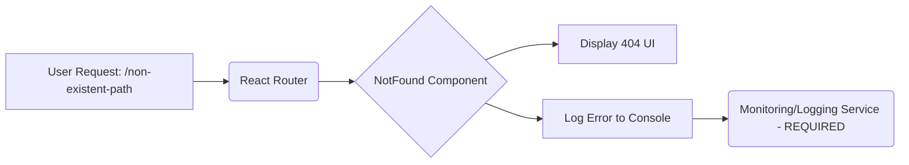

[⬅ Return to Main Compendium](../../README.md)

# 🌐 Component: 404 Not Found Page Handler

This component is responsible for displaying a user-friendly interface when a requested route does not exist within the application's client-side routing configuration. It serves as the catch-all component for 404 errors.

## 🚀 Overview

**Component Name:** `NotFound`
**Technology Stack:** React, React Router DOM
**Purpose:** To intercept and gracefully handle requests to non-existent URIs, providing an informative fallback UI and logging the error internally.

This component significantly improves the user experience (UX) by providing a professional and predictable fallback state instead of showing the browser's default error page.

### System Context Diagram



## 📚 Detail Analysis

### Code Flow & Logic

The component uses two primary React hooks to manage its lifecycle and detect route changes:

1.  **`useLocation()`**: Retrieves the current location object, allowing access to the full pathname (`location.pathname`) of the invalid route.
2.  **`useEffect()`**: This hook executes side effects after rendering. It is crucially tied to `[location.pathname]` dependency. This means that every time the component mounts *or* whenever the user navigates to a different path (even if it's still 404), the effect runs, triggering the error logging.

**Functionality Breakdown:**

*   **Logging:** `console.error("404 Error: User attempted to access non-existent route:", location.pathname);`
    *   *Note:* This provides immediate visibility during development but is insufficient for production.
*   **Rendering:** The component renders a centered, highly visible 404 page using Tailwind CSS classes (`bg-muted`, `flex`, etc.).
*   **Navigation:** A clear hyperlink is provided (`<a href="/">Return to Home</a>`) to guide the user back to a known, stable route.

### Related Files & Links

| File/Module | Description | Link |
| :--- | :--- | :--- |
| **Main Router** | The parent component that wraps the entire application and defines the catch-all route (`<Route path="*" element={<NotFound />} />`). | [../AppRouter/index.jsx] |
| **Global State** | If the error needed to influence global UI state (e.g., showing a site-wide error banner). | [../context/AppContext] |

## 💡 Note & Best Practices

1.  **Improved Logging Strategy (High Priority):** The current `console.error` must be replaced. In a production environment, the logging action should utilize a dedicated logging library (e.g., Sentry, Winston, or a direct API call to an observability platform like Datadog).
2.  **Internationalization (i18n):** The static strings ("404", "Oops! Page not found", "Return to Home") should be extracted and managed via the application's internationalization service (e.g., `useTranslation()`) to support multilingual deployments.
3.  **A/B Testing:** Consider integrating analytics tracking (e.g., Google Analytics) within the `useEffect` hook to log the specific 404 attempt path (`location.pathname`) for product teams to analyze traffic patterns.

## ⚠️ Warning & Tech Debt

### 🛑 Critical Production Concern: Logging

**Do NOT rely on `console.error` in production.** Client-side console logs are easily missed, scrubbed, or ignored.

**Action Required:** Refactor the `useEffect` hook to call an abstraction layer for error logging.

*   **Current Code:**
    ```javascript
    console.error("404 Error: User attempted to access non-existent route:", location.pathname);
    ```
*   **Proposed Abstraction (Example):**
    ```javascript
    import { logError } from '../utils/api/loggingService'; 
    // ... inside useEffect
    logError('404 Not Found', { path: location.pathname, user: userContext.id });
    ```

### Performance Considerations

While this component is lightweight, ensure the parent `AppRouter` handles the `*` route efficiently. Since this component is the final fallback, its rendering speed is critical to maintaining perceived performance when a user types a wrong URL.

### Security Note (CSRF/Auth)

If the user is logged in, consider adding context to the error log that includes the authenticated user ID and session details. This helps security teams identify if unauthorized access attempts are targeting specific resources.