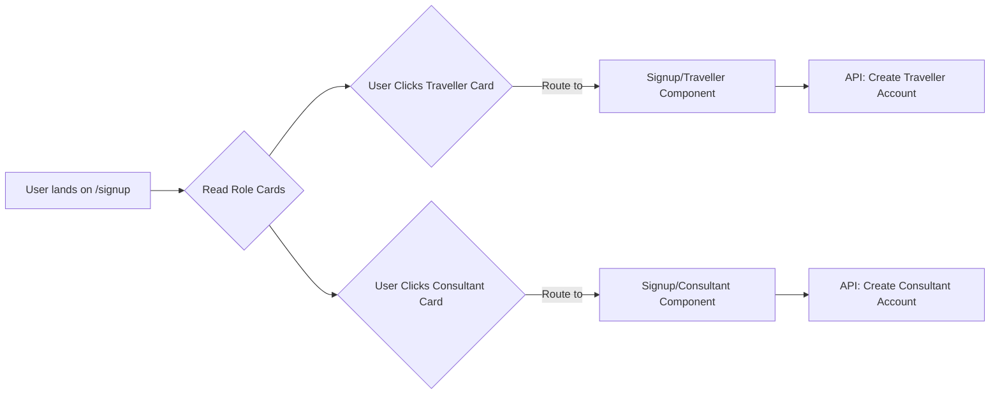

# 🚀 Feature Documentation: User Onboarding Flow (Signup Landing Page)

**File:** `Signup.jsx` (or equivalent)
**Context:** User Authentication / Account Creation Funnel
**System Component:** Frontend Routing / UI Layer
**Knowledge Base Focus:** System Design, Security, Frontend Architecture

***

## 💡 Overview

This component serves as the primary entry point for new users wishing to join the Lokask platform. Its core function is to guide users to the correct dedicated signup flow based on their intended role: **Traveller** or **Consultant**.

The page utilizes a clean, role-based decision card pattern, redirecting users to specialized routes (`/signup/traveller`, `/signup/consultant`). This design pattern effectively segregates the initial onboarding experience, ensuring that different user types are presented with relevant prompts and data collection forms.

## 🔎 Detail Analysis

### 📁 Component Structure and Implementation
The component follows a standard marketing/landing page pattern, incorporating a `Navbar` and `Footer` for site consistency.

1.  **Core Logic:** The main content area is structured using a grid system (`md:grid-cols-2`) to display the two user roles side-by-side.
2.  **Navigation:** Instead of handling signup logic internally, the component leverages React Router's `<Link>` component. This ensures that clicking a role card initiates a client-side route transition, directing the user to the next, specialized page.
3.  **User Roles:**
    *   **Traveller:** Targeted for users seeking local experiences, guiding them to the `/signup/traveller` path.
    *   **Consultant:** Targeted for local experts/businesses, guiding them to the `/signup/consultant` path.
4.  **Visual Design:** The component uses interactive group-hover effects (e.g., color shifts, shadow enhancements) to improve UX and guide the user's focus, providing immediate visual feedback upon interaction.

### 🌐 System Interaction Flow

**Figure:** `Signup Onboarding Flow Diagram`
*Description: Visual representation showing how the main signup page directs users via specialized client-side routing to separate, role-specific signup endpoints.*

## 🛡️ Technical Review & Knowledge Base Insights

### 🔐 Security Engineering Concerns
*   **Role-Based Access Control (RBAC):** While this page handles *selection*, the downstream components (`/signup/*`) must rigorously enforce RBAC. The backend API calls generated from these signup forms must validate the user's claimed role against the credentials provided to prevent privilege escalation.
*   **Input Validation:** Since this component does not handle form submission, validation must be fully delegated to the child routes. Ensure all necessary field validations (email format, password strength, required fields) are implemented before API interaction.
*   **Data Handling:** If sensitive PII (Personally Identifiable Information) is collected, the connection must adhere to current GDPR/CCPA standards, ensuring encrypted transmission (HTTPS/TLS).

### 💻 System Design Considerations
*   **Microservices Approach:** The separation of the signup flow into two dedicated, role-specific routes is excellent system design. It allows the system to independently manage the data models and business logic for a Traveller vs. a Consultant (e.g., a Consultant needs fields for business registration, which a Traveller does not).
*   **API Endpoint Layering:** Two distinct API endpoints should be created:
    1.  `/api/v1/user/signup/traveller`
    2.  `/api/v1/user/signup/consultant`
    These endpoints should handle the creation, role assignment, and initial user profile seeding.

### ☁️ Infrastructure & Cloud Components
*   **Edge Routing:** Ensure the cloud load balancer or API Gateway is configured to handle these multiple signup endpoints efficiently, minimizing latency and providing consistent authentication checks at the gateway level.
*   **Storage:** The initial profile data for both roles must be stored in a robust database system (e.g., PostgreSQL or MongoDB) that supports necessary schema differentiation.

## 📝 Documentation Notes & Best Practices

*   **Accessibility (A11y):** Ensure the interactive card elements have appropriate ARIA labels and keyboard focus states (e.g., `:focus-visible`) to meet WCAG standards.
*   **SEO:** Since this is a public-facing page, ensure appropriate meta tags and structured data markup are included to optimize the page for search engines, describing the core purpose of Lokask.
*   **Error Handling:** Consider adding visual feedback for the *Login* link area (e.g., a small warning if the login route is deprecated or undergoing maintenance).
*   **Testing:** Dedicated unit tests should be written for the component structure and the rendering paths for both role cards. Integration tests should verify that clicking the links successfully navigate to the target routes.

## ⚠️ Warnings (Unfinished/Missing Functionality)

1.  **Backend Integration:** This component is purely a **frontend routing setup**. The actual mechanism for *creating* the user account, assigning the role, and storing initial data is missing and must be built out in the connected services/APIs.
2.  **State Management:** The current implementation assumes successful redirection. Handling failure scenarios (e.g., routing failures, network disconnection) requires additional state management logic not present here.
3.  **Authentication/Authorization:** There is no protection on this route itself, which is acceptable as it is intended for all users. However, any form of account retrieval or listing functionality linked to this flow *must* be secured against unauthorized access attempts.