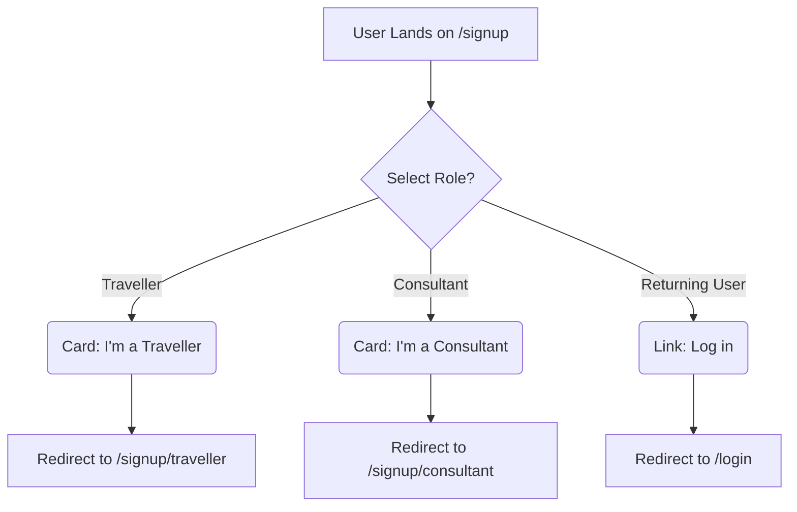

```markdown
[⬅ Return to Main Compendium](../../README.md)

# 🚀 Signup Flow Entry Point (`Signup.jsx`)

This document details the implementation, logic, and architectural considerations for the main user sign-up landing page component. This component serves as a crucial gateway, directing new users to the appropriate specialized sign-up flow based on their intended role (Traveller or Consultant).

---

## 🔍 Overview

The `Signup` component is a highly presentational React component responsible for the initial user onboarding experience on the Lokask platform. Its primary function is not to handle registration logic itself, but rather to guide the user by presenting two distinct paths: **Traveller** and **Consultant**.

This design pattern improves UX by segmenting the signup process immediately, ensuring that the user is presented with forms and questions relevant only to their specific role.

### Key Stakeholders:
*   **Development:** Frontend/React
*   **Function:** User Onboarding, Routing
*   **Related Systems:** Authentication Service, User Role Management.

## 📐 Detailed Breakdown (Component Logic)

### Architecture & Flow
The component utilizes React Router's `<Link>` component to manage routing, effectively acting as a router dispatcher. The structure is designed to be responsive, presenting the two options side-by-side on medium screens and larger (`md:grid-cols-2`).

### Code Logic Highlights
1.  **Layout:** Uses a standard `Navbar` and `Footer` wrapper, ensuring consistency across the application.
2.  **Content Segmentation:** The core logic resides within the `grid` element, which contains two separate "Card" components.
3.  **Card Interaction (Traveller):**
    *   **Route:** Directs to `/signup/traveller`.
    *   **Value Proposition:** Appeals to individuals seeking local discovery and travel planning.
    *   **Styling:** Uses primary branding colors, emphasizing the "local gem" discovery theme.
4.  **Card Interaction (Consultant):**
    *   **Route:** Directs to `/signup/consultant`.
    *   **Value Proposition:** Appeals to local experts or service providers looking to monetize their knowledge.
    *   **Styling:** Uses a distinct blue branding theme, associating it with professionalism and expertise.
5.  **Fallback Link:** Includes a visible link for returning users to navigate to the main `/login` page, maintaining a clear user path regardless of their intent.

---

## 💡 Structural Notes

### User Flow Diagram (Conceptual)



### Component Relationships
This component is critical for initializing user state. The subsequent sign-up components (e.g., `SignupTraveller.jsx`, `SignupConsultant.jsx`) must be designed to accept role-specific parameters or context state upon arrival.

*   **Dependencies:**
    *   `@/components/Navbar`
    *   `@/components/Footer`
    *   `react-router-dom` (`Link`)

---

## ⚠️ Warnings & Tech Debt

### 🚩 1. Future Role Scalability (Most Important)
The current structure is hardcoded for exactly two roles. If the business introduces a third, fourth, or fifth role (e.g., 'Business Partner', 'Admin', 'Reviewer'), this component will require manual code updates and the addition of a new, identical card block.

**Recommendation:** Consider refactoring the card rendering logic using a data array structure.

```javascript
// Pseudo-Code Improvement
const roles = [
  { name: 'Traveller', link: '/signup/traveller', icon: User, description: '...' },
  { name: 'Consultant', link: '/signup/consultant', icon: Briefcase, description: '...' },
  // New roles can be added here without changing the render loop.
];

// Then map over roles to generate the cards.
```

### 🚩 2. Global Design Consistency
While the roles are styled differently (Primary vs. Blue), the transition between the card element's background/border/hover state needs careful review to ensure the visual separation does not feel jarring.

### 🚩 3. Accessibility (A11y)
Ensure that the focus order (tab sequence) is logical. Since the cards are implemented as links, they should be properly marked up as interactive elements and have visible focus states for keyboard navigation.

## 📚 Documentation Links

*   **Related Component: Traveller Signup Flow:** [`../signup/traveller/SignupTraveller.jsx`](../signup/traveller/SignupTraveller.jsx)
    *   *Purpose:* Handles sign-up specific to travelers.
*   **Related Component: Consultant Signup Flow:** [`../signup/consultant/SignupConsultant.jsx`](../signup/consultant/SignupConsultant.jsx)
    *   *Purpose:* Handles sign-up specific to consultants.
*   **Global Auth Flow:** [`../login/LoginPage.jsx`](../login/LoginPage.jsx)
    *   *Purpose:* Central login page.
```