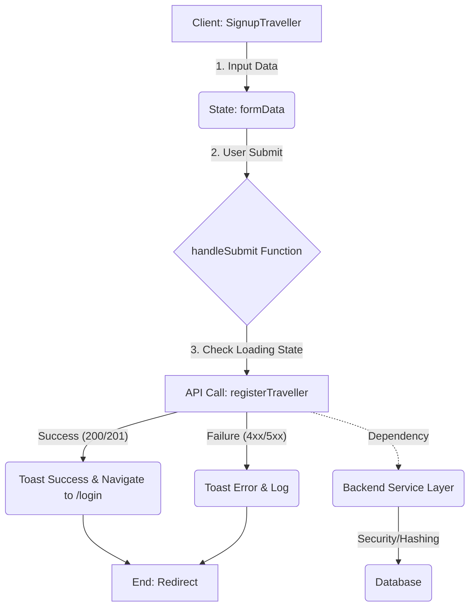

```markdown
[⬅ Return to Main Compendium](../../README.md)

# 🗺️ Module: Traveller Registration Form (`SignupTraveller`)

This document details the implementation, functionality, and architectural considerations for the Traveller account signup component. It serves as the primary entry point for users wishing to register their accounts as a service traveller.

---

## 💡 Overview

The `SignupTraveller` component is a client-side React functional component responsible for presenting a user-friendly form for new traveller registrations. It handles client-side state management for form inputs, manages submission logic, interacts with the backend API via `registerTraveller`, and provides robust user feedback using toast notifications.

### 📁 Related Files & Components
*   **API Interaction:** `../lib/api` (specifically `registerTraveller`)
*   **UI Elements:** `Navbar`, `Footer`
*   **Navigation Flow:** `Login` component (for redirects after successful signup)

## ⚙️ Detail Analysis

### Component Structure
The component follows a standard React setup, incorporating React Hooks (`useState`, `useNavigate`) and external libraries for UI feedback (`sonner`) and routing (`react-router-dom`).

1.  **State Management:**
    *   `formData`: Stores the user's input (`fullName`, `email`, `password`). Initialized to empty strings.
    *   `isLoading`: A boolean state used to disable the submit button and display a loading spinner during the API call, preventing duplicate submissions.
2.  **Submission Logic (`handleSubmit`):**
    *   The handler prevents default form submission behavior (`e.preventDefault()`).
    *   It sets `isLoading` to `true` immediately.
    *   It calls the asynchronous API function `registerTraveller(formData)`.
    *   **Success Path:** Upon successful API resolution, a success toast is displayed, and the user is redirected to the `/login` route.
    *   **Error Path:** A `try...catch` block handles any API or network errors, displaying a relevant error toast to the user.
    *   **Cleanup:** The `finally` block ensures `isLoading` is reset to `false`, regardless of success or failure, enabling the button again.

### 🚀 Coding Flow
1.  **Render:** Component renders the main layout, including `Navbar` and `Footer`.
2.  **Form Display:** Renders the form with three inputs (Name, Email, Password), linked via `onChange` handlers to update `formData`.
3.  **Action:** User fills form and clicks submit.
4.  **Submission:** `handleSubmit` is triggered $\rightarrow$ `isLoading` becomes `true`.
5.  **API Call:** `registerTraveller` is called $\rightarrow$ Component waits/disables button.
6.  **Result:** Success $\rightarrow$ Redirect to `/login`. Error $\rightarrow$ Display error message.

### 📐 Code Snippet Flow Reference
*   **API Call:** Refer to the external API definition here: [API Integration: `registerTraveller`](../lib/api)
*   **Error Handling:** The structure for handling API failures is robust: see the `try...catch` block in `handleSubmit`.

## 📝 Note

### ⭐️ Best Practices Followed
1.  **Accessibility:** Uses semantic HTML elements, clear labels, and appropriate placeholders.
2.  **UX Feedback:** Implements immediate visual feedback using loading states and toasts, vastly improving perceived performance.
3.  **Separation of Concerns:** The component focuses purely on presentation and state handling, delegating business logic (hashing, validation, database insertion) entirely to `registerTraveller`.

### 📌 Areas for Improvement (Future Scope)
1.  **Client-Side Validation:** While `required` attributes are used, implementing advanced client-side validation (e.g., checking password strength, validating email regex) before the API call would enhance UX and reduce unnecessary network traffic.
2.  **Input Reusability:** Consider extracting the common input field structure (label, input, value, onChange) into a reusable `FormInput` component to clean up the main render block.
3.  **Loading State UX:** While a spinner is present, consider implementing a skeleton loading screen for the entire form area instead of just disabling the button, providing a smoother visual experience during the API wait time.

## ⚠️ Warning (High Priority / Tech Debt)

### 🚨 Critical Security Warning: API Key Management
*   **Issue:** The file explicitly shows importing and using `registerTraveller` from `@/lib/api`. If this API function makes calls directly using client-side secrets or hardcoded keys, **this constitutes a severe security vulnerability.**
*   **Action Required:** The API logic *must* be encapsulated within a secure backend layer (e.g., using a dedicated API gateway or Cloud Function) to ensure that API keys, hashing salts, and database credentials are never exposed to the client bundle.

### 🚨 Missing Input Validation (Security/UX)
*   **Issue:** The current implementation relies on the backend to validate data integrity (e.g., ensuring unique email addresses). If the API only returns a generic error, the user experience is poor.
*   **Action Required:** Update the `catch` block to attempt to parse specific error codes (e.g., `400 Bad Request`, `409 Conflict`) from the API response to display targeted, user-friendly error messages (e.g., "This email is already in use.").

## 🧠 Knowledge Base Integration

### ☁️ Infrastructure & System Design
*   **System Component:** This module is the Presentation Layer (Client).
*   **Data Flow:** Client $\rightarrow$ API Gateway $\rightarrow$ Backend Service (e.g., Lambda/Microservice) $\rightarrow$ Database.
*   **Scalability Consideration:** Since this is a signup process, the underlying `registerTraveller` function must utilize a stateless, auto-scaling backend architecture (like AWS ECS/Lambda or Google Cloud Run) to handle sudden bursts of registration traffic.
*   **Security Consideration:** The registration process must integrate robust authentication protocols (e.g., requiring two-factor authentication setup immediately, or using temporary verification links/emails).

### 🔒 Security Engineer Perspective
*   **Input Sanitization:** Although React helps prevent XSS on the client side, the backend API **must** perform rigorous sanitization and validation on all inputs (`fullName`, `email`, `password`) to prevent SQL injection or NoSQL injection attacks before interacting with the database.
*   **Password Handling:** The backend must enforce strong hashing standards (e.g., Argon2 or bcrypt with sufficient work factors) for storing passwords. **Never store passwords in plain text.**
*   **Rate Limiting:** Implement rate limiting on the API gateway endpoint for `/register` to mitigate brute-force or denial-of-service attempts.

### 📊 Generated Figure (Conceptual Flow)
*(This figure illustrates the logical flow and dependency management)*

