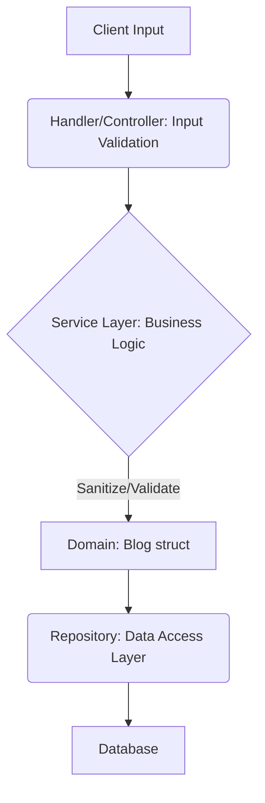

[⬅ Return to Main Compendium](../../README.md)

# 🛡️ Security & Domain Review: `domain/blog.go`

*File Type:* Data Model / Struct Definition
*Component:* Blogging System Domain Layer
*Security Focus:* Input Validation, Content Sanitization, Data Integrity

---

## 🚨 Security Vulnerability Summary

The provided file defines the data structure (`Blog`) but contains no business logic (methods). Therefore, the primary security risks are related to **data handling, input validation, and sanitization** that must occur *outside* this domain layer (e.g., in handlers or services) before data is persisted or rendered.

| Vulnerable Element | Vulnerability Type | Priority | Description |
| :--- | :--- | :--- | :--- |
| `Content`, `Summary`, `Title` (Strings) | Stored XSS, Injection | **High** | These are user-generated content fields and must be sanitized and escaped upon input and rendering. |
| `CoverImageURL` (String) | SSRF, Malicious Resource | **High** | Requires strict validation (schema, domain whitelist) to prevent fetching malicious content or abusing internal resources. |
| `AuthorName`, `AuthorAvatar` (Strings) | Data Integrity, Authorization Bypass | **Medium** | These fields are joined data. Logic must enforce that the user viewing the data is authorized to see this specific combined view. |
| All String Fields | Input Validation | **Medium** | Lack of length constraints or character set validation on user input (City, Country, etc.) could lead to database overflow or logical errors. |

---

## 📝 Detailed Review

### `domain/blog.go`

**Overview:**
This file defines the core data model for a blog post. It encapsulates the primary information (content, metadata, authors) related to a single blog entry. The use of `db:` and `json:` tags suggests this struct is used for direct database mapping and API serialization.

**Detail (Vulnerability Deep Dive):**

#### 🔴 High Priority: Input Sanitization & Injection Risks
The primary danger lies in the string fields accepting untrusted user input.

1.  **`Content`, `Summary`, `Title` (Stored XSS / Injection):**
    *   **Risk:** If these fields accept raw HTML or script tags and that content is later rendered on a frontend without proper context-aware escaping, it results in Stored Cross-Site Scripting (XSS).
    *   **Mitigation:** Implement a robust sanitization library (e.g., OWASP Java HTML Sanitizer, or equivalent Go library) at the **service layer** before saving the data to the database. *Never trust user input.*

2.  **`CoverImageURL` (SSRF / Malicious Fetch):**
    *   **Risk:** An attacker could provide an internal IP address (e.g., `http://127.0.0.1/admin`) or a private resource URL. If the system attempts to fetch this URL for processing or display, it can lead to Server-Side Request Forgery (SSRF) or attempt to load non-public assets.
    *   **Mitigation:**
        *   Validate the URL schema (must be `https`).
        *   Implement IP validation (blocking private/reserved ranges: `10.0.0.0/8`, `172.16.0.0/12`, `192.168.0.0/16`, `127.0.0.1`).
        *   Consider whitelisting allowed domains for images.

#### 🟡 Medium Priority: Data Integrity & Logic Flows
These risks relate to the integrity of the data flow and the combination of multiple sources.

1.  **`AuthorName`, `AuthorAvatar` (Authorization/Data Source Trust):**
    *   **Risk:** These fields are explicitly marked as "JOIN" fields. If the system trusts the combined data without checking if the ID owner (the author) is authorized to contribute that data, or if the linked source (e.g., a user profile API) is compromised, the system can present false or unauthorized data.
    *   **Mitigation:** Ensure that any service call populating these fields includes robust *authorization checks* based on the authenticated user's privileges and the ownership of the content.

2.  **String Fields (`City`, `Country`):**
    *   **Risk:** Simple lack of input validation can lead to issues like overly long strings that cause database truncation or unexpected behavior.
    *   **Mitigation:** Implement strict input validation (max length, allowed character sets, e.g., must be alphanumeric).

**Note (Tech Debt & Future Improvements):**

1.  **Input Validation Layer:** This structure needs to be paired with a dedicated input validation model (e.g., `blog_input.go`) that enforces constraints (min/max length, regex patterns) *before* mapping to the domain struct.
2.  **Type Safety for UUIDs:** While `uuid.UUID` is used, consider wrapping the ID types in custom types (e.g., `type BlogID uuid.UUID`) to improve compile-time safety and prevent accidental passing of unrelated UUIDs.
3.  **Image Handling:** The `CoverImageURL` should ideally reference an internal resource ID (like a unique file hash or S3 key) rather than a raw URL, forcing all image access through an authenticated, rate-limited, and validated internal service endpoint.

**Warning (CRITICAL Action Items):**

1.  **IMMEDIATE Action:** All code paths that read data into `Title`, `Summary`, and `Content` **must** pass the input through a sanitization routine before being written to the database.
2.  **CRITICAL Check:** When constructing any query that involves fetching `CoverImageURL` or any user-provided string, treat the input as *tainted*. All rendering must utilize templating engines that perform **context-aware escaping** (e.g., escaping HTML entities `<` and `>`).
3.  **Architecture Flow:** To enforce these security layers, please ensure that the service layer (`service/blog_service.go`) is the sole authority for transforming raw input data into the `Blog` domain model, thus centralizing validation and sanitization logic.

### 📂 Related Components Flow Diagram

*(Figure Placeholder: A diagram showing the required flow: `HTTP Request` -> `Handler/Controller` (Input Validation) -> `Service Layer` (Sanitization/Business Logic) -> `Domain Model` (struct validation) -> `Repository` (Persistence))*

**Related Files/Links:**

*   **Handler/Controller:** `../handlers/blog_handler.go` (Validation layer implementation)
*   **Service Layer:** `../services/blog_service.go` (Sanitization and business logic enforcement)
*   **Repository Layer:** `../repository/blog_repository.go` (Data mapping and persistence checks)