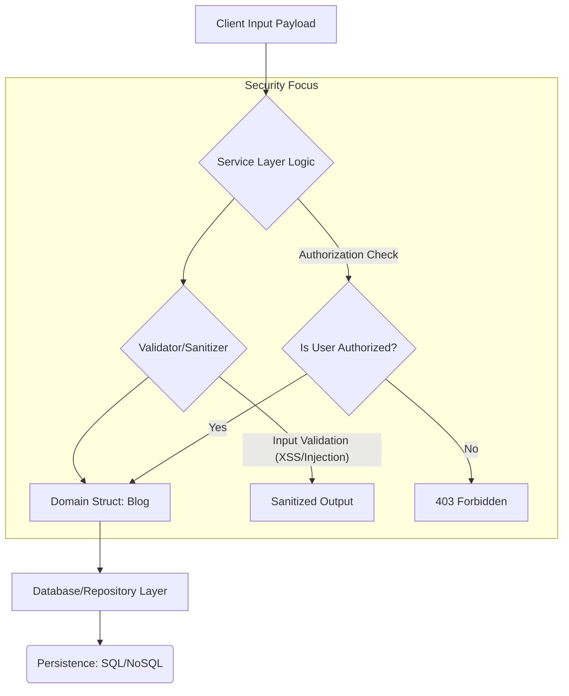

# Blog Domain Model Analysis

[⬅ Return to Main Compendium](../../README.md)

## 📖 Overview

This file defines the core `Blog` domain model structure within the `domain` package. This struct represents a blog post and aggregates data related to the post itself, its metadata (like city/country), and display attributes (like the author's name/avatar) which are typically populated through join queries in the application layer.

This structure is fundamental for read operations (fetching blog data) and write operations (creating/updating blog data).

### 📊 Vulnerability Summary

| Component/Field | Vulnerable Payload | Potential Attack Type | Priority | Mitigation Strategy |
| :--- | :--- | :--- | :--- | :--- |
| **`Content`**, `Summary`, `Title` | Malicious HTML/JS payloads | Cross-Site Scripting (XSS) | **High** | Implement strict output encoding and sanitization (e.g., using libraries like `bluemonday` or filtering only whitelisted tags). |
| `CoverImageURL` | Malformed/External URLs | SSRF (Server-Side Request Forgery), Insecure Asset Loading | **Medium** | Validate URL schemas (must be `http(s)`) and enforce whitelisting of allowed domain origins. |
| `AuthorName`, `AuthorAvatar` | Injection data (e.g., full paths) | Data Integrity Compromise | **Low** | Ensure data integrity at the source; if these fields are populated via joins, the join logic must be trust-based. |
| All string fields | User-provided input strings | NoSQL/SQL Injection (if used directly) | **Medium** | Although `db` tags suggest ORM usage, all inputs must be validated and parameterized to prevent injection vectors. |

---

## 🔍 Detailed Analysis

### 📚 Purpose and Logic

This struct is designed to be the canonical representation of a blog post record within the application boundaries. It separates concerns by including both core database fields (`db` tags) and optional display/join fields (`AuthorName`, `AuthorAvatar`).

The inclusion of non-primary key display fields (`AuthorName`, `AuthorAvatar`) is a common pattern but requires careful handling in the service layer to ensure data consistency and prevent stale or incorrect data presentation.

### 🧱 Field Breakdown

| Field | Type | Function | Security Consideration |
| :--- | :--- | :--- | :--- |
| `ID`, `AuthorID` | `uuid.UUID` | Primary and Foreign Keys. | **Crucial:** Must be used with robust authorization checks (e.g., Does the requesting user have permission to view/modify this resource?). |
| `Title`, `Summary`, `Content` | `string` | Main textual content. | **CRITICAL:** Primary vector for XSS. Requires sanitization. |
| `CoverImageURL` | `string` | URL pointing to the cover image. | **HIGH:** Requires validation (URL format, whitelisted domains). |
| `City`, `Country` | `string` | Geographic context. | Input validation (e.g., regex, length limits) is necessary to prevent data bloat or format attacks. |
| `Rating`, `ReviewCount` | `float64`, `int` | Metrics. | Ensure these fields are updated using atomic operations (transactions) to maintain data integrity. |
| `CreatedAt`, `UpdatedAt` | `time.Time` | Audit fields. | Should generally be managed by the persistence layer (database triggers or ORM hooks) to ensure they cannot be overwritten by malicious client input. |
| `AuthorName`, `AuthorAvatar` | `string` | Join fields. | Read-only/display only. Treat them as derived data, not primary input fields. |

### ⚙️ Conceptual Flow Links

*   **Authorization Flow:** Links to `../middleware/auth` (Must check ownership rights before reading or writing the blog resource).
*   **Persistence Logic:** Links to `../repository/blog_repository.go` (This is where validation and secure querying must occur).
*   **Input Validation:** Links to `../utils/validator` (All string inputs must pass validation here).

---

## ⚠️ Critical Warnings & Tech Debt (Notes)

1.  **Unsanitized Content (High Priority):** The most immediate and significant risk is the handling of rich text content (`Content`). If this content is rendered directly into an HTML page without robust server-side sanitization (e.g., stripping `<script>`, `onerror`, and handling dangerous tags), the application is vulnerable to Stored XSS.
2.  **Missing Validation Logic:** This file only defines the *structure* (the schema). It does not enforce *business rules* (e.g., "Rating must be between 0.0 and 5.0," or "Content cannot be empty"). Input validation logic must be added in the service layer before persisting data.
3.  **Join Fields Consistency:** The fields `AuthorName` and `AuthorAvatar` are non-domain attributes derived from related entities. The persistence layer must guarantee that if the underlying author data changes, these cached fields are either updated or, preferably, the service layer should always re-query the author data at read time to prevent stale data.
4.  **Error Handling & Auditing:** Consider implementing proper logging and auditing hooks for critical operations like content updates, especially if the content is sensitive or subject to legal compliance.

## 🖼️ Structural Diagram (Conceptual)

