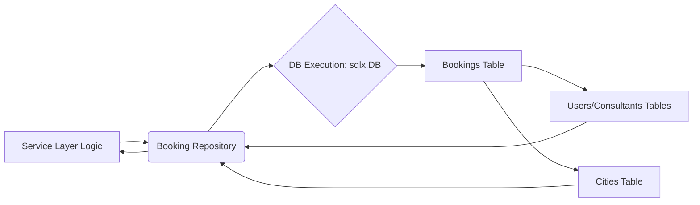

[⬅ Return to Main Compendium](../../README.md)

# 📚 Booking Repository Module (`repository/booking.go`)

**Status:** Stable (Requires service layer input validation and type standardization)
**Purpose:** Database layer handling all CRUD and query operations related to booking slots. This module abstracts database interactions, ensuring transactionality and proper data access through SQLx.

---

## 🛡️ Security Verification Analysis

The repository layer uses parameterized queries extensively, which is the primary defense against SQL Injection. However, vulnerabilities primarily exist in the lack of type enforcement and business logic validation checks performed at the repository level.

| Target/Function | Vulnerability Type | Priority | Recommended Fix |
| :--- | :--- | :--- | :--- |
| `CreateBookingTx` | Input Validation (Business Logic) | High | Implement validation checks for price, time overlap, and required fields *before* starting the transaction (Should occur in Service Layer, but repository should enforce constraints). |
| `IsBookingOwner` | Type Safety/Coercion | Medium | The comparison `c.user_id = $2` uses `$2` (the provided `userID`) as a string, while `b.consultant_id` uses `uuid.UUID`. Ensure type consistency for the ownership check parameter (`userID` should ideally be `uuid.UUID`). |
| `ConsultantBookingView`/`UserBookingView` | Data Exposure (Over-fetching) | Medium | While generally necessary, ensure that these views do not inadvertently expose sensitive data (e.g., internal IDs or cost details) that should be masked or filtered by the service layer. |
| **General** | Lack of Context/Deadline Handling | Low | While `SelectContext` and `ExecContext` are used, it's good practice to verify that context cancellation is robustly handled throughout all database operations, especially in long-running transactions. |

---

## 📝 Overview

This package, `repository`, serves as the Data Access Layer (DAL) for booking management. It utilizes `sqlx` to interface with the underlying SQL database, providing methods to create, retrieve, update, and delete booking records.

The core functionality revolves around generating complex JOIN queries to pull comprehensive booking views (`ConsultantBookingView` and `UserBookingView`), aggregating user, consultant, and location details into single, consumable structures.

### 📁 Related Modules & Files
*   `domain/booking.go`: Defines the canonical `BookingEntry` structure used for transaction inputs.
*   `model/booking_view.go`: (Internal, Conceptual) Where the view structs are defined.
*   `service/booking_service.go`: This module is responsible for calling methods here and must handle all input validation.

### 🖼️ Conceptual Data Flow Diagram

---

## 🔎 Detail & Implementation Flow

### 📦 Structures

#### `ConsultantBookingView`
Used when a consultant views their own bookings. It consolidates their name/avatar/city details alongside the booking data, simplifying the query result handling.

*   **Key Fields:** `TravellerName`, `TravellerAvatar`, `TravellerLocation`, `ConsultantName`, `ConsultantAvatar`, `ConsultantCity`.
*   **Usage Flow:** `GetConsultantBookings` $\rightarrow$ Populates this struct.

#### `UserBookingView`
Used when a user (consultant) views bookings related to *themselves* (i.e., their client bookings). It reverses the role of name/avatar comparison.

*   **Key Fields:** `ConsultantName`, `ConsultantAvatar`, `CityName`.
*   **Usage Flow:** `GetUserBookings` $\rightarrow$ Populates this struct.

#### `BookingRepository`
The primary struct holding the connection pool (`*sqlx.DB`).

### ⚙️ Core Functions

1.  **`NewBookingRepository(db *sqlx.DB)`**
    *   **Purpose:** Constructor. Initializes the repository with an established database connection.
    *   **Flow:** Simple initialization.

2.  **`CreateBookingTx(tx *sqlx.Tx, b *domain.BookingEntry) error`**
    *   **Purpose:** Inserts a new booking record within an active database transaction.
    *   **Logic:** Executes a parameterized `INSERT` query and uses `RETURNING` to populate the local `*domain.BookingEntry` object with the newly created `id`, `status`, `created_at`, and `updated_at` timestamps.
    *   **Security:** Secure against SQL Injection due to `sqlx.Tx.QueryRow`.

3.  **`GetConsultantBookings(ctx context.Context, consultantID uuid.UUID) ([]ConsultantBookingView, error)`**
    *   **Purpose:** Retrieves all bookings associated with a specific consultant, regardless of who booked it.
    *   **Logic:** Performs complex multi-JOIN query (bookings $\to$ users (traveller) $\to$ consultants $\to$ cities). Filters strictly by `b.consultant_id = $1`.
    *   **Security:** Secure against SQL Injection.

4.  **`GetUserBookings(ctx context.Context, userID uuid.UUID) ([]UserBookingView, error)`**
    *   **Purpose:** Retrieves all bookings made by a specific user (assuming this user is acting as a consultant viewing their client bookings).
    *   **Logic:** Performs multi-JOIN query (bookings $\to$ consultants $\to$ users (consultant) $\to$ cities). Filters strictly by `b.user_id = $1`.
    *   **Security:** Secure against SQL Injection.

5.  **`DeleteBooking(ctx context.Context, id uuid.UUID) error`**
    *   **Purpose:** Soft or hard deletes a booking record by its unique ID.
    *   **Security:** Secure against SQL Injection.

6.  **`UpdateBookingStatus(ctx context.Context, id uuid.UUID, status string) error`**
    *   **Purpose:** Updates the status and `updated_at` timestamp of an existing booking.
    *   **Security:** Secure against SQL Injection.

7.  **`IsBookingOwner(ctx context.Context, bookingID uuid.UUID, userID string) (bool, error)`**
    *   **Purpose:** Verifies if the consultant associated with a given booking ID is linked to the provided user ID. This is a critical authorization check.
    *   **Logic:** Uses a `SELECT EXISTS` check joining `bookings` and `consultants` and verifying the link between `c.user_id` and the provided `$2` (user ID).
    *   **Security:** While the query structure is safe, the type handling between `UUID` (input) and `string` (input) is fragile.

---

## 💡 Notes and Warnings (Dev Notes)

1. **Transaction Handling:** If multiple actions modify the database (e.g., booking creation followed by payment status update), the calling service *must* wrap these calls in an explicit database transaction to ensure atomicity.
2. **Scope Creep:** Be wary of adding new complex logic (e.g., time zone validation, multi-day booking logic) directly into the service layer. Consider moving these complex validations to domain-specific business services or middleware to maintain separation of concerns.
3. **Error Handling:** The current structure relies heavily on the database driver for connection and query errors. The calling layer must implement robust `try-catch` blocks that translate low-level database errors into high-level, meaningful application error codes (e.g., `ERR_ACCOUNT_NOT_FOUND` instead of `pq: relation "users" does not exist`).
4. **Concurrency:** If the system anticipates high-volume writes (e.g., flash sales, mass bookings), review the database connection pool configuration to prevent connection exhaustion and deadlocks.

---
*Generated Structure for Developers: This service is highly robust for read operations. For write operations, ensure atomic transactions.*