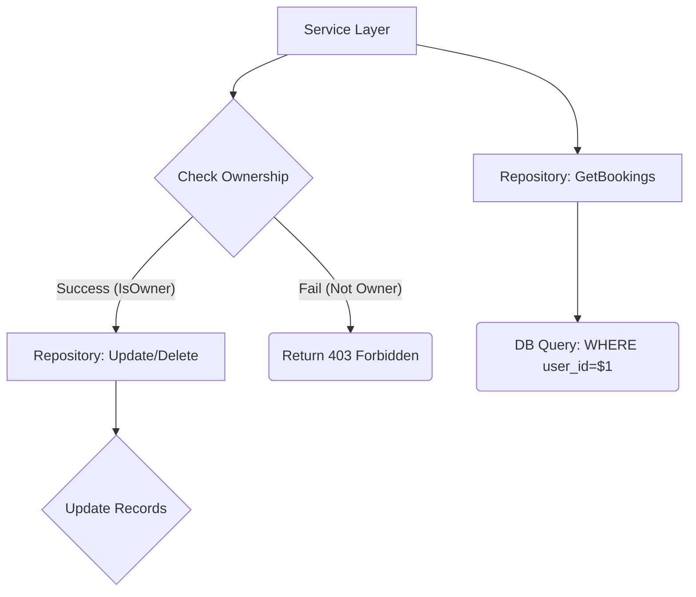

```markdown
[⬅ Return to Main Compendium](../../README.md)

# 📚 Repository Layer Review: `repository/booking.go`

**Component:** Booking Repository
**Purpose:** Handles all persistence logic for booking slots, including creation, retrieval, modification, and deletion.
**Security Context:** Database interaction, Authorization (Ownership checks).

***

## 🛡️ Security Vulnerability Analysis

| Function/Object | Vulnerability/Risk | Priority | Description |
| :--- | :--- | :--- | :--- |
| `IsBookingOwner` | Type Mismatch/Inconsistency | **High** | The `userID` parameter is defined as `string`, but the surrounding context and database schema likely use `uuid.UUID`. Passing a `string` could lead to incorrect comparisons or runtime failures if the database column (`c.user_id`) expects a specific UUID type. |
| All Mutation Functions | Missing Pre-Check Authorization | **Medium** | While `IsBookingOwner` exists, the calling service layer functions (`DeleteBooking`, `UpdateBookingStatus`) should *mandatorily* call `IsBookingOwner` before executing any destructive or state-changing operation. Relying solely on the application logic is brittle. |
| `UpdateBookingStatus` | Lack of Input Constraint | **Medium** | The `status` parameter is a raw `string`. If this string is not validated against a predefined set of allowed statuses (e.g., "CONFIRMED", "CANCELED"), a malicious actor could update the booking to an invalid or undesirable state, leading to inconsistent data. |
| All Repository Functions | N/A (Good Practice) | **Low** | Excellent use of parameterized queries (`$1`, `$2`, etc.) across all methods, effectively mitigating SQL Injection risks. |

## 🔍 Detailed Review

### 📝 Overview

This repository package encapsulates the data access logic for booking entries. It is highly structured, utilizing `sqlx.DB` and `context.Context` correctly. The architectural separation between the domain models (`domain.BookingEntry`) and the view models (`ConsultantBookingView`, `UserBookingView`) is clean. The use of transactions (`CreateBookingTx`) ensures atomicity during creation.

### 🧠 Core Logic and Flow

The repository provides distinct read paths based on user roles:
1.  **Consultant View (`GetConsultantBookings`):** Filters bookings where the consultant is the primary owner (`WHERE b.consultant_id = $1`). It correctly joins `users`, `consultants`, and `cities` to enrich the view data.
2.  **User View (`GetUserBookings`):** Filters bookings where the user is the client (`WHERE b.user_id = $1`). The joins are appropriate for displaying client history.
3.  **Mutation Path:** Operations like `DeleteBooking` and `UpdateBookingStatus` are simple CRUD operations. Crucially, the `IsBookingOwner` function provides the necessary mechanism for *application-level* authorization checks before mutation.

### ⚠️ Critical Notes & Warnings (Technical Debt / Improvement)

1.  **Type Consistency in `IsBookingOwner` (HIGH PRIORITY FIX):**
    *   **Issue:** The function signature uses `userID string`, but the query compares it to `c.user_id` (which should match the type of `b.user_id`, likely `uuid.UUID`).
    *   **Action:** Change the function signature and internal logic to accept and use `uuid.UUID` for the `userID` parameter to ensure type safety and prevent potential database comparison errors.
    *   **Code Location:** `IsBookingOwner` function definition and call sites.

2.  **Defensive Programming in Mutation Flow (MEDIUM PRIORITY):**
    *   The functions `DeleteBooking` and `UpdateBookingStatus` currently accept only `id`. The business logic dictates that the caller **must** first check ownership using `IsBookingOwner` *before* attempting the mutation.
    *   **Recommendation:** While this is technically a service layer issue, the repository should consider adding helper functions (e.g., `DeleteBookingForOwner(ctx, id, ownerID)`) that internally combine the ownership check and the mutation, providing stronger data consistency guarantees.

3.  **Status Validation (MEDIUM PRIORITY):**
    *   The `UpdateBookingStatus` function accepts a raw `string` for status. Statuses should be validated against an enumerated type (or at least a known, limited set of constants) to prevent arbitrary data writes.

### 🔗 Structural Linkage (Code Flow & Logic)

*   **Ownership Check:** The `DeleteBooking` and `UpdateBookingStatus` functions must link their execution flow to the validation provided by:
    *   `[../middleware/auth]`: The middleware layer should ideally ensure that the incoming user context (the caller's ID) is passed to the service layer, which then passes it to `IsBookingOwner`.
*   **Data Flow:** The data structure views (`ConsultantBookingView`, `UserBookingView`) rely on data available in the `User` and `Consultant` entity definitions.
    *   *Reference:* Ensure that the `users` table used in `GetConsultantBookings` refers to the correct user model (i.e., the user who *booked* vs. the user who *is* the consultant).

### 🧩 Object & Payload Vulnerability Summary

| Component | Payload/Object | Vulnerability Risk | Mitigation/Notes |
| :--- | :--- | :--- | :--- |
| `ConsultantBookingView` | `traveller_name`, `traveller_avatar`, etc. | Low | Data representation is safe, assuming the underlying DB fields are secured. |
| `UserBookingView` | `consultant_name`, `consultant_avatar`, etc. | Low | Data representation is safe. |
| `IsBookingOwner` | `userID` (Type) | **High** | **Action:** Must use `uuid.UUID` type instead of `string`. |
| `UpdateBookingStatus` | `status` (String input) | **Medium** | **Action:** Implement strict validation on the `status` string (use an enum/constant check). |

---
***Generated Figure: Data Flow Diagram Concept***
(This section conceptually links the components.)

