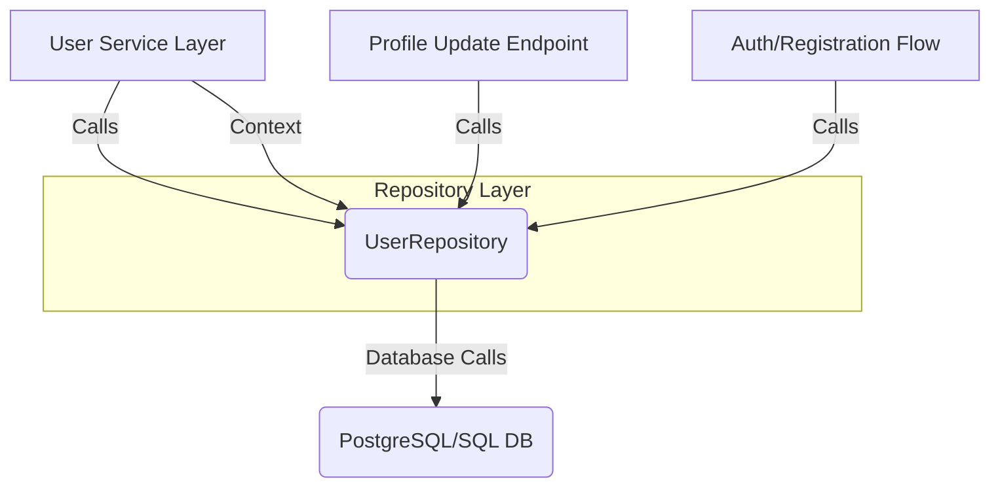

```markdown
[⬅ Return to Main Compendium](../../README.md)

# 🛡️ Security & Design Review: User Repository Layer (`repository/repository.go`)

**Module:** Data Access Layer (DAL) / Repository
**Component:** `User` Model and `UserRepository` Implementation
**Date:** 2023-10-27
**Engineer:** Documentation-Security Verification Engine

---

## 📖 Overview

This repository layer is responsible for abstracting the database operations related to user data management. It encapsulates standard CRUD (Create, Read, Update, Delete) functionalities for the `User` entity, including critical business logic like user registration via transaction blocks and email verification workflows.

The implementation uses `github.com/jmoiron/sqlx` for database interaction, which enforces the use of parameterized queries, successfully mitigating common **SQL Injection (SQLi)** vulnerabilities. The design generally adheres to sound principles of data encapsulation within a dedicated repository pattern.

## ⚙️ Vulnerability & Risk Assessment Summary

| Priority | Area | Function(s) | Description |
| :--- | :--- | :--- | :--- |
| **Medium** | **Race Conditions/Consistency** | `UpdateAvatar`, `CreateUserTx` | Potential for lost updates or inconsistent state if concurrency controls (e.g., optimistic locking) are not enforced at the business layer. |
| **Medium** | **Input Validation/Abuse** | `VerifyUserEmail` | The endpoint relies solely on the token provided. Lacks rate limiting or advanced token source validation, potentially allowing limited brute-force attempts. |
| **Low** | **Database Best Practice** | `UpdateAvatar` | Manual handling of `updated_at` timestamps (`time.Now()`) is non-idiomatic. Best practice dictates letting the database handle its own temporal indexing. |

---

## 🔍 Detail Analysis

### 1. Data Model (`User` struct)

| Field | Vulnerability Concern | Severity | Notes |
| :--- | :--- | :--- | :--- |
| `PasswordHash` | **None (Passed)** | N/A | Proper use of `json:"-"` prevents serialization/logging of sensitive data. Assumption: Hashing function is cryptographically secure (e.g., Argon2/Bcrypt) and salt is handled upstream. |
| `VerificationToken`, `TokenExpiresAt` | **Low (Expiry Handling)** | N/A | The fields are correctly utilized in the verification logic. Ensure the service layer enforces proper token expiration policy (e.g., 24 hours maximum). |

### 2. `UserRepository` Functions

#### `CreateUserTx(tx *sqlx.Tx, ...)`
*   **Flow Logic:** Uses database transactions, which is excellent for maintaining atomicity.
*   **Vulnerability:** While the query structure is safe (no SQLi), there is a potential **Race Condition/Business Logic Flaw**. If two requests attempt to create a user with the same `user.Email` concurrently, the transaction may commit both (depending on DB isolation levels) or fail poorly, without explicit uniqueness constraint checking *before* the transaction begins in the service layer.
*   **Mitigation:** Enforce a `UNIQUE INDEX` constraint on the `email` column at the DB level. The service layer must also perform a pre-check for email existence.
*   **Cross-Reference:** This function requires strong dependency on the `User Management Service` (Assumed: `../services/user_service`).

#### `GetByEmail(email string)` & `GetByID(userID string)`
*   **Flow Logic:** Basic read operations using parameterized queries.
*   **Vulnerability:** **Data Exposure Risk (Mitigated)**. The code correctly selects specific fields and excludes `PasswordHash`.
*   **Improvement:** None necessary regarding security. Consider if fetching the `AvatarURL` and placing it into `AvatarURLJSON` adds unnecessary complexity; consider if the client can operate solely on the DB-mapped fields.

#### `UpdateAvatar(userID uuid.UUID, avatarURL string)`
*   **Flow Logic:** Updates a single field (avatar URL) for a given user ID.
*   **Vulnerability:** **Time Stamping/Data Integrity (Low Priority)**. Using `time.Now()` in the application code is brittle. If the application clock is incorrect, the `updated_at` column will be inaccurate.
*   **Impact:** Low data integrity impact; high maintenance burden.
*   **Action:** Refactor to rely on database default values (`DEFAULT CURRENT_TIMESTAMP`).
*   **Cross-Reference:** This function must be called by the `Profile Update Endpoint` (Assumed: `../middleware/profile`).

#### `VerifyUserEmail(ctx context.Context, token string)`
*   **Flow Logic:** Checks and updates user status based on a token.
*   **Vulnerability:** **Rate Limiting/Denial of Service (DoS) Risk (Medium Priority)**. If this endpoint is called without proper rate limiting (e.g., limited requests per IP or per user ID within a short window), an attacker can rapidly attempt to brute-force tokens or simply trigger unnecessary database writes, potentially leading to resource exhaustion.
*   **Defense:** Must be placed behind a rate-limiting middleware.
*   **Cross-Reference:** This function is intrinsically linked to the `Auth/Registration Flow` (Assumed: `../middleware/auth`).

---

## 📝 Notes & Technical Debt

*   **Context Usage:** The use of `context.WithTimeout` in `UpdateAvatar` is commendable. Ensure that all external calls originating from this repository layer consistently pass contexts derived from the initial request context to enforce propagation of deadlines and cancellations.
*   **Error Handling:** The error handling, particularly in `VerifyUserEmail`, provides a helpful, business-level error (`invalid or expired verification token`) instead of raw database errors. This is good practice.
*   **UUID Conversion:** Note that `UpdateAvatar` accepts `uuid.UUID` but the function signature suggests the repository layer is doing the type enforcement. Ensure the upstream service layer handles the conversion from API string inputs (e.g., JSON body) to `uuid.UUID` consistently.

## ⚠️ Warnings & Immediate Remediation

1.  **Token Endpoint Protection (CRITICAL):** Implement strict **rate limiting and IP blocking** on the service endpoint calling `VerifyUserEmail`. This is the single most critical external vulnerability point in this module.
2.  **Concurrency Controls (HIGH):** For transactions involving state changes (like `CreateUserTx`), the corresponding service layer must handle concurrent writes safely. Consider implementing **Optimistic Locking** by adding a `version` column to the `users` table and including it in the WHERE clause for updates.
3.  **Database Schema Enforcement (MEDIUM):** Do not rely on application code for temporal stamping. Modify the database schema to enforce `updated_at TIMESTAMP DEFAULT CURRENT_TIMESTAMP ON UPDATE CURRENT_TIMESTAMP` for better data integrity and resilience.

***

### 📊 Figure: Data Flow Dependency Map

*(Figurative representation of module dependency)*



**Legend:**
*   **B:** `UserRepository`
*   **C:** Data Persistence Layer
*   **A, D, E:** Upstream Services Calling the Repo

*(Recommendation: Ensure the context passed from A, D, and E contains tracing information for comprehensive logging and auditing.)*
```