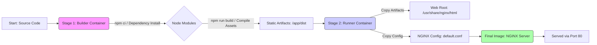

[⬅ Return to Main Compendium](../../README.md)

# ⚙️ Dockerfile Analysis: Static Frontend Deployment Pipeline

This document provides a comprehensive security and architectural review of the provided Dockerfile. It analyzes the multi-stage build process, identifies potential vulnerabilities, and suggests hardening measures for deployment.

## 🛡️ Security Vulnerability Assessment

| Component/Object | Vulnerability Type | Priority | Remediation Suggestion |
| :--- | :--- | :--- | :--- |
| **Build Stage:** `npm ci` | Dependency Confusion/Supply Chain Attack | **High** | Use artifact registries (e.g., private NPM registry) and checksum verification. |
| **Builder/Runner Transition** | Accidental Dependency Leakage | **Medium** | Ensure the builder is wiped clean of unnecessary artifacts before copying. |
| **`nginx-dev.conf`** | Misconfiguration/Insecure Defaults | **High** | Must be reviewed for restrictive headers (HSTS, CSP) and proper error handling. |
| **Runner Base Image** | Operational Security (OS) Hardening | **Medium** | Run the final NGINX process using a specific non-root user defined by the base image, even if using the unprivileged variant. |
| **Build Output (`/app/dist`)** | Code Injection/Path Traversal (If not sanitized) | **Low** | Verify that the build process cannot be tricked into generating malicious paths or content. |

---

## 📝 Overview

This Dockerfile implements a robust, multi-stage build process designed to containerize a static Single Page Application (SPA) or frontend asset bundle. It uses Node.js for dependency installation and building, and then utilizes a minimal NGINX image to serve only the final compiled assets, ensuring that the production container does not contain development tools or source code.

**Purpose:** To securely and efficiently deploy static web assets (e.g., React, Vue, Angular builds) using NGINX as the serving layer.

---

## 🔬 Detail Analysis

### Stage 1: Builder (`FROM node:20-alpine AS builder`)

This stage is responsible for resolving dependencies and compiling the application code.

| Line/Action | Purpose | Security Implication |
| :--- | :--- | :--- |
| `COPY package.json package-lock.json* bun.lockb* ./` | Copies lock files first (good for caching). | **Good Practice:** This allows Docker to cache the `npm ci` step if only source code changes. |
| `RUN npm ci --silent` | Installs dependencies based on lock files. | **Security Risk:** If the dependency registry is compromised, the system installs malicious packages. |
| `COPY . .` | Copies the entire source code. | **Security Risk:** If secrets (API keys, `.env` files) are in the root directory, they are copied into the build container. |
| `RUN npm run build` | Executes the frontend build script. | **Dependency on `package.json`:** The build process must not leak environmental secrets or keys to the build artifacts. |

### Stage 2: Runner (`FROM nginxinc/nginx-unprivileged:alpine3.23-perl AS runner`)

This stage creates the lightweight, minimal production image.

| Line/Action | Purpose | Security Implication |
| :--- | :--- | :--- |
| `COPY --from=builder /app/dist /usr/share/nginx/html` | Copies only the compiled assets. | **Good Practice:** This adheres to the principle of building separate from serving. |
| `COPY nginx-dev.conf /etc/nginx/conf.d/default.conf` | Overwrites the default NGINX configuration. | **Critical:** This config file must be treated as sensitive infrastructure code and thoroughly reviewed for security hardening (e.g., blocking access to specific headers, setting proper MIME types). |
| `EXPOSE 80` | Publicly declares the listening port. | Standard practice. |
| `CMD ["nginx", "-g", "daemon off;"]` | Starts the NGINX service. | The use of the `nginx-unprivileged` image helps contain process separation, which is a strong positive. |

---

## 💡 Note (High Importance/Architectural Considerations)

1.  **Secret Management:** It is paramount that *no* environment variables, API keys, or private secrets are passed or available to the builder container during `npm run build`. If the build process requires credentials, use temporary secrets mounting (e.g., Docker BuildKit secrets).
2.  **Build Cache Optimization:** The current structure is good, but ensure that if the `package.json` changes, you only re-run `npm ci` and not the entire build, to optimize CI/CD time.
3.  **Error Handling in Build:** Review the build logs. If the `npm run build` step fails, ensure the logs reveal *why*, as this can often point to misconfigurations or dependency issues.

## ⚠️ Warning (Technical Debt & Best Practices)

1.  **Dockerfile Security Best Practice:** Never rely solely on `FROM nginxinc/nginx-unprivileged`. For maximum hardening, always add a final `USER nonrootuser` instruction *after* all configuration copies to explicitly drop privileges immediately before running the CMD.
2.  **`nginx-dev.conf` Dependency:** The security posture of this entire service depends heavily on the content of `nginx-dev.conf`. If this file is missing security headers (e.g., `Content-Security-Policy`, `Strict-Transport-Security`), the service is vulnerable to client-side attacks.
3.  **Alpine Size:** While `alpine` images are small, they use `musl libc`, which differs from `glibc`. This is generally fine for web services but must be accounted for if any complex native binaries are used outside the standard web components.

---

## 📑 Suggested Code Flow Links

*   **`nginx-dev.conf`:** This configuration file dictates the entire web serving logic. All logic contained here must be audited separately.
    *   *Link to related configuration review:* (../config/nginx-dev.conf)
*   **`package.json`:** Defines the build steps and required dependencies.
    *   *Link to dependency manifest:* (./package.json)

## 🖼️ Generated Structure Figure (Conceptual Flow)

