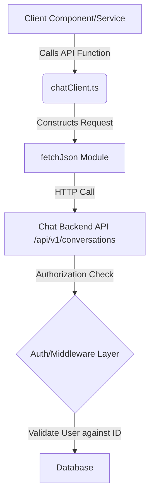

```markdown
[⬅ Return to Main Compendium](../../README.md)

# 🛠️ API Client Functions for Chat Services (`chatClient.ts`)

## 📊 Security Vulnerability Assessment

This module acts as an API client wrapper layer. While it abstracts the network calls, it relies heavily on the integrity of the input parameters (IDs and content) and assumes the calling context handles proper authentication and authorization.

| Vulnerable Element | Vulnerability Type | Severity | Description | Remediation Strategy |
| :--- | :--- | :--- | :--- | :--- |
| **`conversationId` Usage** (All functions) | Insecure Direct Object Reference (IDOR) | **High** | Functions accept `conversationId` directly from the caller without verifying that the currently authenticated user has explicit ownership or access rights to that specific resource ID. | Implement middleware/guard layer that validates resource ownership using the user's token/context ID against the provided `conversationId` *on the API gateway side*. |
| **`content` Parameter** (`sendMessage`) | Cross-Site Scripting (XSS) / Input Sanitization | **Medium** | Message content passed via the body could contain malicious scripts. While the backend should handle sanitization, the client should enforce length limits and suggest sanitization before sending. | Implement strict input sanitization (e.g., stripping HTML/JS) at the client or service layer. Enforce maximum content length. |
| **Error Handling** (`getChatSession`) | Information Leakage | **Low** | The `catch (error: any)` block might be too broad. Returning generic `error` objects can leak infrastructure details (stack traces, database connection types) if the API wrapper doesn't standardize the error response. | Standardize error handling to return only necessary, non-sensitive HTTP status codes and generalized error messages to the client. |
| **Missing Validation** (All parameters) | Type Confusion / Injection | **Medium** | The functions assume `conversationId` is always a valid, non-null string. Lack of explicit type/format validation (e.g., UUID regex) increases the risk of injection attempts. | Implement mandatory, strict validation (e.g., using Zod or Yup schemas) on all input parameters before calling `fetchJson`. |

---

## 📖 Module Overview

This module centralizes the interaction logic with the chat API endpoints (`/api/v1/conversations`). It provides typed wrappers for common chat workflows: initializing conversations, retrieving message history, sending new messages, listing all conversations (inbox), and checking session status for billing.

### Architecture Diagram



### 🔑 Key Design Principles

1. **Abstraction:** Hides the underlying HTTP request details from consumer components.
2. **Type Safety:** Uses defined interfaces (`Conversation`, `ChatMessage`) for predictable data handling.
3. **Security Concern:** The current design lacks an explicit, centralized authorization check within the client wrapper itself, making it susceptible to IDOR if the calling code relies solely on the function being called.

---

## 🔍 Detailed Function Analysis

### 1. `startChat(consultantId: string)`

*   **Endpoint:** `POST /api/v1/conversations`
*   **Purpose:** Initiates a new chat thread.
*   **Input:** `consultantId` (The ID of the consultant starting the chat).
*   **Output:** `Conversation` object (ID of the newly created chat).
*   **Security Detail:** This function uses the provided `consultantId` in the body. The backend must ensure that the ID supplied matches the identity or permissible scope of the actual authenticated user, preventing a user from impersonating another consultant.
*   **Cross-Reference:** *Requires validation check against [User Profile Service](../../profile-service.ts)*

### 2. `getChatHistory(conversationId: string)`

*   **Endpoint:** `GET /api/v1/conversations/:id/messages`
*   **Purpose:** Retrieves the complete message history for a specific conversation.
*   **Input:** `conversationId` (The ID of the conversation to check).
*   **Output:** `Promise<ChatMessage[]>` (Array of messages).
*   **Security Detail:** **CRITICAL IDOR RISK.** The function accepts any `conversationId`. The system MUST verify that the caller has viewing rights for this specific conversation ID.
*   **Cross-Reference:** *Relates directly to [Authentication/Authorization flow](../../auth.go)*

### 3. `sendMessage(conversationId: string, content: string)`

*   **Endpoint:** `POST /api/v1/conversations/:id/messages`
*   **Purpose:** Sends a new message within an existing conversation.
*   **Input:** `conversationId` (Target chat ID), `content` (Message text).
*   **Output:** `Promise<ChatMessage>` (The sent message object).
*   **Security Detail:** **AUTHORIZATION + INPUT VALIDATION.** This function requires *both* ownership validation (does the user own this `conversationId`?) and content sanitization (is the `content` safe?).
*   **Cross-Reference:** *The `content` payload handling should be reviewed by the [Input Sanitization Module](../../utils/sanitization).*

### 4. `getInbox()`

*   **Endpoint:** `GET /api/v1/conversations`
*   **Purpose:** Retrieves a list of all conversations the user is involved in (the user's inbox view).
*   **Input:** None (Relies on context/session user ID).
*   **Output:** `Promise<Conversation[]>` (List of conversation summaries).
*   **Security Detail:** This endpoint is less risky regarding IDOR as it lists conversations *for* the authenticated user, but the backend must strictly enforce the scoping (i.e., only show conversations belonging to the requesting user).
*   **Cross-Reference:** *Should utilize the [Auth Token context](../../auth.go) to scope the request.*

### 5. `getChatSession(conversationId: string)`

*   **Endpoint:** `GET /api/v1/conversations/:id/session`
*   **Purpose:** Checks if there is an active chat session, likely for billing or operational monitoring.
*   **Input:** `conversationId` (Target chat ID).
*   **Output:** `any` (Session data or `null`).
*   **Security Detail:** **IDOR RISK & Error Handling.** Similar to `getChatHistory`, the `conversationId` must be authorized. The `try/catch` block masks potential security issues if the `error` object structure changes or is malformed.
*   **Cross-Reference:** *Error handling logic should be generalized and checked against the [System Error Registry](../../config/errors).*

---

## 📝 Engineering Notes & Warnings

### ⚠️ Technical Debt / Critical Warning

1. **Missing Authorization Layer (P0):** The most critical vulnerability is the lack of authorization enforcement. A middleware layer must be placed *before* any API call utilizing a resource ID (`conversationId`) that performs checks: `Is the authenticated user authorized to view/write to this specific resource ID?`.
2. **Client-Side vs. Server-Side Validation:** Never rely on client-side input validation. All input parameters (IDs, content) must be validated, type-checked, and sanitized on the backend service level.
3. **Refactoring `fetchJson`:** If `fetchJson` is a custom wrapper, consider if it can be enhanced to automatically include JWT/session tokens and handle retries/backoff strategies internally, reducing boilerplate in every calling function.

### 💡 Suggested Enhancements

*   **Error Typing:** Improve the error handling across the board. Instead of `try/catch (error: any)`, use specific error types or rely on the `fetchJson` module to throw standardized, typed API errors.
*   **Dedicated Chat Service:** As the complexity grows, consider moving this client file into a dedicated `services/chat` directory structure, ensuring proper separation of concerns from core API calls.
*   **State Management:** If this module is used within a React/Vue context, consider pairing it with a dedicated state management pattern (like Redux Toolkit or Zustand) to handle loading states and global error propagation consistently.
```