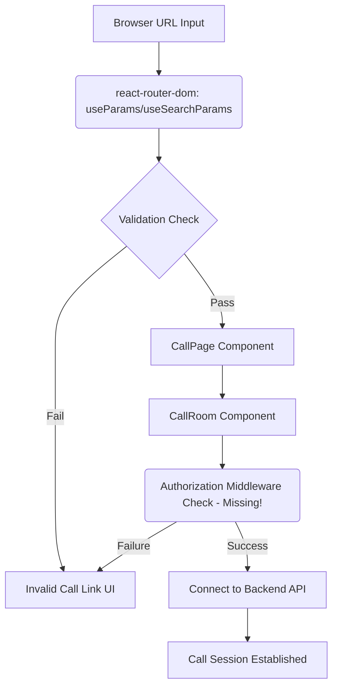

# CallPage Component Security Verification Report

[⬅ Return to Main Compendium](../../README.md)

## 🛡️ Overview
The `CallPage` component is a client-side React utility responsible for initializing and rendering the main call interface. It extracts critical session parameters (`roomId` and `serviceType`) directly from the browser's URL query parameters and uses them to render the core application component, `CallRoom`.

The current implementation handles basic missing parameter checks but relies heavily on the integrity and authorization provided by the front-end routing state.

## 📚 Detailed Analysis

### Code Logic Flow
1.  **Parameter Extraction:** The component uses `useParams()` to retrieve `roomId` and `useSearchParams()` to retrieve `serviceType` (e.g., `video_call` or `voice_call`). These values originate entirely from user-controlled input (the URL).
2.  **Input Validation (Client-side):** A basic check confirms that both `roomId` and `serviceType` are present. If not, the component renders an error page.
3.  **Component Rendering:** If validation passes, the component renders `<CallRoom>`, passing the extracted `roomId` (mapped to `bookingId`) and `serviceType` as props.
4.  **Lifecycle Hook:** It sets an `onClose` handler using `window.close()`, designed to close the current browser window upon leaving the call interface.

### Security Assessment Findings

| Element | Function/Object | Vulnerability Type | Risk Level | Description |
| :--- | :--- | :--- | :--- | :--- |
| **`roomId`** | URL Parameter Input | **IDOR (Insecure Direct Object Reference)** | **HIGH** | The component accepts any `roomId` from the URL and passes it directly to `CallRoom`. There is **no authentication or authorization check** to confirm if the currently logged-in user is permitted to view or join the call associated with this ID. |
| **`roomId`** | Prop Passed to `CallRoom` | **Lack of Sanitization/Type Checking** | **MEDIUM** | The component assumes `roomId` is a valid format (e.g., UUID or numerical ID). If the ID contains non-standard characters, it could cause downstream issues in the backend or `CallRoom` component if it fails to sanitize or validate the input type. |
| **`onClose`** | `window.close()` | **Security/UX Issue** | **LOW** | Using `window.close()` can sometimes fail in modern browsers or is easily bypassed, leading to a poor user experience or failing to execute necessary cleanup logic (e.g., revoking tokens). |
| **Payload** | `serviceType` | **Improper Input Validation** | **MEDIUM** | Although constrained via TypeScript (`"video_call" | "voice_call"`), client-side validation is easily bypassed. If the backend or component logic relies solely on this client-side check, it could lead to unsupported service types being processed. |

## 🚨 Vulnerability Summary & Mitigation Plan

### 🥇 High Priority Vulnerability
**Vulnerability:** Insecure Direct Object Reference (IDOR) via `roomId`
**Impact:** An unauthorized user can manipulate the URL to join private calls or access sensitive meeting data simply by guessing or obtaining a valid `bookingId`.
**Mitigation:** Authorization checks **MUST** be enforced on the backend/API gateway layer. The backend must verify that the authenticated User ID associated with the API request matches the owner/participant list for the provided `roomId`.

### 🥈 Medium Priority Vulnerability
**Vulnerability:** Lack of Comprehensive Input Validation and Sanitization
**Impact:** Although React helps mitigate XSS in rendering, passing unvalidated parameters means the application logic could break, or malicious data could be processed by the downstream `CallRoom` component.
**Mitigation:** Implement strict data schema validation for both `roomId` (e.g., UUID format validation) and `serviceType` on both the client and, crucially, the server side.

### 🥉 Low Priority Vulnerability
**Vulnerability:** Client-Side Session Termination
**Impact:** Poor user experience and unreliable cleanup.
**Mitigation:** Replace `window.close()` with robust state management or a controlled redirect that informs the user of the session termination and cleans up any local state, allowing the parent route to handle the cleanup.

## 📝 Notes and Documentation Recommendations

1.  **Backend Linkage:** The logic for validating `roomId` must mirror the validation performed by the dedicated booking/meeting service endpoint. (Link to `../api/booking-service.py` - Must validate against the database).
2.  **Authorization Context:** The component should ideally receive the current user's authorization token or context, which must then be included in any subsequent API calls made within `CallRoom` to ensure the user has the right to access the resource.
3.  **State Management:** Consider lifting the validation and fetching of the call details state into a context provider to centralize authorization logic, rather than passing raw, unvalidated URL parameters.

## ⚠️ Warnings & Tech Debt

*   **Critical Tech Debt:** The dependency on URL parameters for authorization is a fundamental security flaw. The architecture needs a dedicated middleware or guard that intercepts the route and confirms user ownership of the resource *before* rendering `CallPage`.
*   **Refactoring Recommendation:** The parameter validation logic (`if (!roomId || !serviceType)`) should trigger a centralized `NotFound` or `AccessDenied` component, rather than just a generic "Invalid Call Link." This allows us to differentiate between a non-existent URL and an unauthorized access attempt.

***

### 🖼️ Conceptual Flow Diagram (Data Dependency)

