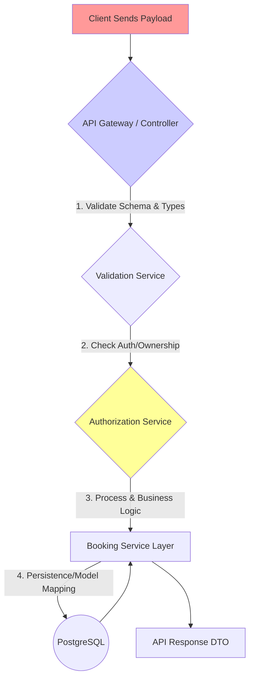

```markdown
[⬅ Return to Main Compendium](../../README.md)

# 🛡️ Security Verification Report: Booking Models (Typescript Interfaces)

**File Scope:** Defines core data structures (DTOs/Interfaces) for the Booking service.
**Last Updated:** 2023-10-27
**Verification Engineer:** Documentation-Security Team
**Risk Level:** Medium (Requires strong enforcement in usage layers)

---

## 📚 📂 Structure & Links

This file defines the schemas for data exchange. All consumer components must adhere to stringent validation rules before processing.

*   [🔗 Booking Service Logic (Implied Use Case)](../services/booking.service.ts)
*   [🔗 API Controller Layer (Implied Entry Point)](../controllers/booking.controller.ts)
*   [🔗 Utility/Validation Layer (Recommended Practice)](../utils/validation.ts)

---

## 🔍 Overview

The input file defines three critical data structures: `ServiceType` and `BookingStatus` (Enums), `Booking` (A comprehensive record of a scheduled appointment), and `CreateBookingRequest` (The payload used to initiate a new booking).

The primary security concern here is *Trust Boundary Violation* and *Incomplete Input Validation*. Since these are merely types, they provide structure but offer no enforcement mechanism. Any layer consuming these types (e.g., Controllers or Services) *must* implement robust validation, sanitization, and authorization checks.

### 🚨 Vulnerability Summary

| Function/Field | Description | Vulnerability Type | Priority | Mitigation Focus |
| :--- | :--- | :--- | :--- | :--- |
| `Booking.id`, `user_id`, `consultant_id` | Unique identifiers. | Insecure Direct Object Reference (IDOR) | High | Mandatory ownership checks (RBAC) |
| `Booking.user_notes`, `Booking.total_price` | String/Number input fields. | Injection/Business Logic Flaws | Medium | Sanitization, Boundary/Type checking |
| `CreateBookingRequest` | Entire input payload. | Missing Input Validation (Mass Assignment) | High | Whitelisting, Schema Validation |
| `Booking` fields (all) | View fields (read-only). | Excessive Data Exposure | Medium | Strict API Endpoint Scoping |

---

## 📑 Detail Analysis

### 1. Enums (`ServiceType`, `BookingStatus`)

These types provide good type safety but rely entirely on the consuming code to ensure the strings received match one of the defined constants.

**Recommendation:** Always validate incoming API requests against the defined union type *before* deserializing into the model.

### 2. `Booking` Interface (The Core Record)

This interface represents a fully realized, often read-only, view of a successful booking record.

*   **Security Concern:** The inclusion of many *view fields* (`traveller_name`, `consultant_city`, etc.) means that if this interface is serialized and returned through an API endpoint, the calling component must enforce **Least Privilege Principle**. A client requesting only their booking details should *not* inadvertently receive details about other users or sensitive corporate metadata.
*   **Mitigation:** Implement DTOs (Data Transfer Objects) specific to the *viewing context* (e.g., `UserBookingViewDTO`, `AdminBookingViewDTO`) rather than passing the raw `Booking` object.

### 3. `CreateBookingRequest` Interface (The Write Payload)

This is the most critical area for security enforcement. It defines what a user is *allowed* to submit.

*   **Security Concern (High Priority):** The current structure is vulnerable to **Mass Assignment** or **Incomplete Validation**. A malicious or flawed client might attempt to submit extra fields (e.g., `isAdmin: true`, `status: "completed"`) that are not explicitly listed in `CreateBookingRequest`.
*   **Required Check:** The backend logic must strictly validate that *only* the fields listed (`consultant_id`, `start_time`, `service_type`, `user_notes`, `total_price`) are present and that they conform to expected types (e.g., price must be a positive number).

---

## ⚠️ Warning (Technical Debt & Unfinished Tasks)

1.  **Mandatory Input Validation Implementation:** This types file must be treated as a contract. The associated controller or service layer *must* integrate a validation library (e.g., `class-validator`, Joi) to validate all incoming payloads against the schemas.
2.  **Timezone Handling:** The use of raw ISO strings for `start_time` and `end_time` is acceptable, but the implementation must enforce UTC conversion at the boundary layer (API Gateway/Controller) to prevent time zone ambiguity bugs and calculation errors.
3.  **Authorization Enforcement:** **CRITICAL:** Every function that reads, updates, or creates a `Booking` record *must* check ownership (`user_id` must match the authenticated user ID, unless administrative scope is present). Failure to do this results in predictable IDOR vulnerabilities.

## 🧠 Note (Architectural Best Practices)

To improve security and maintainability, consider adopting a layered DTO approach:

1.  **Input DTO:** (e.g., `CreateBookingRequest`) - Only whitelisted fields.
2.  **Service DTO:** (Internal format used by business logic) - Contains processed, validated data.
3.  **Output DTO:** (e.g., `UserBookingResponse`) - Only the minimum necessary data for the client to function.

### 🖼️ Pseudo-Code Flow Diagram (Illustrative)

This diagram shows the required security checkpoints for the booking creation flow.


*Explanation: The arrows represent mandatory checks. If any step (C, D) fails, the process must immediately return a 400 or 403 error.*