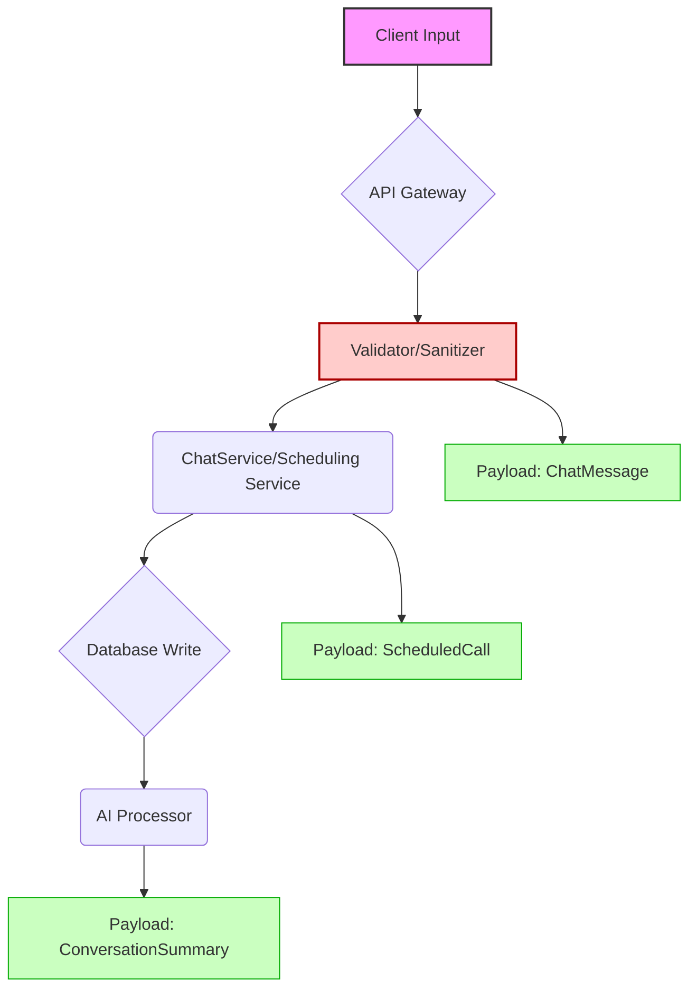

[⬅ Return to Main Compendium](../../README.md)

# 🛡️ Data Structures Security Review: Communication Payloads

**File analyzed:** `src/types/chat.ts` (Conceptual Typing Definitions)
**Reviewed By:** Documentation-Security Verification Engineer
**Date:** October 26, 2023

## 💡 Overview

This file defines three critical data payloads (`ScheduledCall`, `ChatMessage`, `ConversationSummary`) used for scheduling, core chat functionality, and AI-generated content summaries. While these are purely type definitions and do not contain business logic, they define the *schema* of data that moves through the system.

The primary security focus must be on **Input Validation**, **Data Sanitization**, and **Authorization Scope** for every field defined here. Failure to validate or sanitize these structures can lead to Cross-Site Scripting (XSS), Injection attacks, and data integrity compromise.

## 🔍 Detail: Vulnerability and Attack Vector Analysis

### 🟢 `ScheduledCall` Interface

| Field | Type | Vulnerability Concern | Priority | Recommended Mitigation |
| :--- | :--- | :--- | :--- | :--- |
| `id` | `string` | Predictability/Brute Force if UUID generation is weak. | Medium | Ensure UUID v4 generation. |
| `conversationId` | `string` | Authorization Bypass (Can a user schedule a call on someone else's chat?). | High | Mandatory ownership/scope check (`OwnerID` required). |
| `type` | `"video" | "voice"` | Input validation required. | Low | Use strict enums/validation. |
| `scheduledAt` | `Date` | Time Manipulation/Race Conditions. | Medium | Implement robust timezone handling and server-side time locking. |
| `duration` | `number` | Business logic constraints (e.g., duration cannot be 0 or excessively large). | Low | Server-side bounds checking. |
| `status` | Enum | Unauthorized State Transitions (e.g., changing status from `cancelled` to `completed`). | High | Implement state machine logic with explicit permissions checks for status updates. |
| `notes` | `string?` | XSS Injection (if notes are displayed raw). | Medium | Always sanitize/escape `notes` content when rendering. |

### 🟡 `ChatMessage` Interface

This payload is the most complex and presents the highest attack surface due to multiple content types.

| Field | Type | Vulnerability Concern | Priority | Recommended Mitigation |
| :--- | :--- | :--- | :--- | :--- |
| `content` | `string` | **Critical XSS Risk.** (If HTML/Markdown rendering is allowed without sanitization). | High | Strict input sanitization (e.g., DOMPurify) and context-aware output encoding. |
| `sender_id` | `string` | Authorization/Impersonation. | High | All incoming messages must be authenticated against the sender's claimed ID. |
| `is_read` | `boolean` | Data Integrity (Tampering with read receipts). | Low | Server-side state management for read receipts; only allow status updates based on connection signals. |
| `imageUrl` | `string` | SSRF/Malicious Content Fetching (If the image link is user-provided). | High | Implement a robust CDN/asset fetching service and validate image sources against allowed domains. |
| `mapData` | Object | XSS/Injection in map parameters. | Medium | Treat all map data fields (name, address) as user input; escape before display. |

### 🟠 `ConversationSummary` Interface

This payload is derived from AI, making it susceptible to data integrity attacks or manipulation.

| Field | Type | Vulnerability Concern | Priority | Recommended Mitigation |
| :--- | :--- | :--- | :--- | :--- |
| All fields | `string[]` | **Data Poisoning/Trust Abuse.** If the underlying chat data is compromised, the AI summary will also be compromised and displayed as fact. | High | Implement traceability and confidence scoring for AI-generated claims. The summary must cite source messages/timestamps. |
| `preferences` | `string[]` | Data Validation. | Medium | Ensure the processing layer validates the format and length of derived strings. |

## ⚙️ Architectural Flow and Dependencies

**Conceptual Code Flow:**
1. Client sends Message $\rightarrow$ API Gateway $\rightarrow$ Chat Service.
2. Chat Service validates/sanitizes $\rightarrow$ Writes to DB.
3. (Later) Chat Service triggers AI $\rightarrow$ AI Model processes DB records $\rightarrow$ Returns `ConversationSummary`.

### 🔗 File Linking

*   **`ChatMessage`** $\rightarrow$ Requires secure implementation in `../services/chat-message-service.ts` (Input Sanitization).
*   **`ScheduledCall`** $\rightarrow$ Must use state machine logic defined in `../services/scheduling-service.ts` (Authorization/State Check).
*   **`ConversationSummary`** $\rightarrow$ Requires robust integration layer with the AI endpoint, potentially residing in `../integrations/ai-processor.ts`.

## ⚠️ Notes (Tech Debt & Open Issues)

1. **Missing Validation Layer:** These are types, but they do not enforce validation rules (e.g., minimum content length, maximum URL length, required format for IDs). A dedicated validation schema (e.g., using Zod or Joi) must be implemented *before* these types are used in service layers.
2. **Timestamp Consistency:** The `ChatMessage` uses `created_at: string` while `ScheduledCall` uses `Date`. Consistency is required throughout the codebase to avoid timezone issues and parsing failures.
3. **Avatar/User Data:** There is no defined payload for user profiles, avatars, or general metadata. This should be captured to prevent context injection (e.g., assuming a user ID exists when it does not).

## 🚨 Warnings (Critical Issues)

1. **CRITICAL XSS RISK IN `ChatMessage.content`:** Any display mechanism that renders `content` (or any field within `mapData`) without aggressive, context-aware output encoding is a critical vulnerability. Assume all user-provided text is malicious.
2. **SECURITY LOOPHOLE IN `ScheduledCall.status`:** The system must never trust the client to update the status. All status transitions must be gated by an internal, audited state machine that verifies the calling user has the required permissions *and* that the transition is logically possible (e.g., cannot go from `cancelled` back to `pending`).
3. **AUTH SCOPING FOR ALL PAYLOADS:** Every object (Message, Call, Summary) must be tied to an `ownerId` or `scopeId` at the API level. Failure to scope payloads will result in massive authorization bypass vulnerabilities.

***

### 🖼️ Conceptual Payload Flow Diagram

*(Self-correction: A physical figure cannot be generated, but a conceptual flow is described to simulate a diagram linking the components.)*

**Legend:**
*   **Red (A $\rightarrow$ C):** The primary security choke point (Input Validation).
*   **Green (D $\rightarrow$ I/H):** The operational services responsible for processing and enforcing schema constraints.
*   **AI Processor (F $\rightarrow$ G):** The derived, high-trust data source.