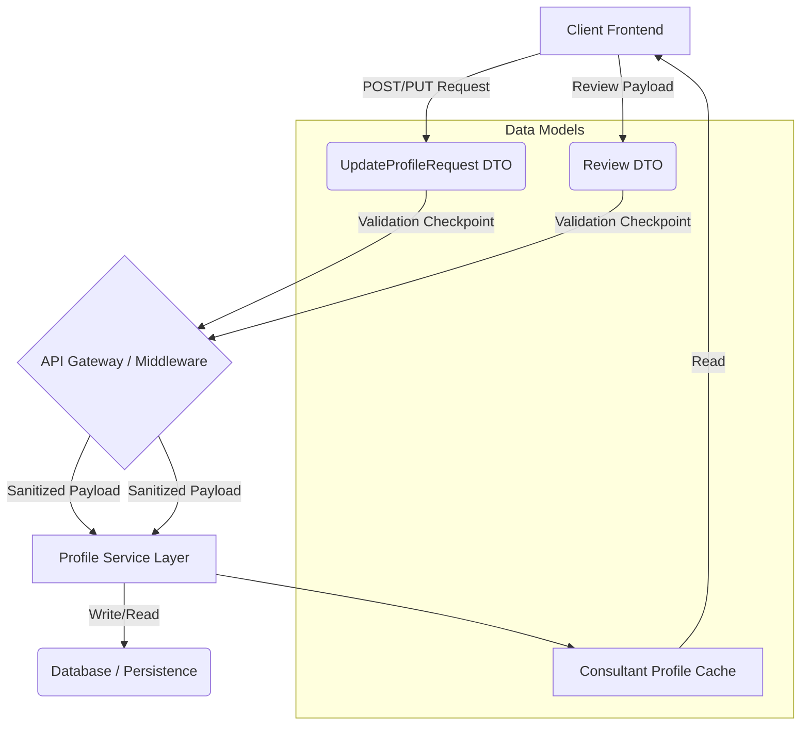

[⬅ Return to Main Compendium](../../README.md)

# 📄 Data Model Verification Report: Profile & Review Structures

**File:** `interfaces.ts` (Assumed filename)
**Date:** October 26, 2023
**Author:** Documentation-Security Verification Engineer
**Domain:** Core User Profile Management, Review System

---

## 🌟 Overview

This document provides a security and architectural review of the core data transfer objects (DTOs) and interface definitions used for managing consultant profiles, user badges, and service reviews.

The interfaces define the schema for:
1.  `Badge`: Structure for displaying achievements.
2.  `Review`: Structure for user feedback.
3.  `Consultant`: The main, complex profile structure.
4.  `UpdateProfileRequest`: The payload used for updating a user's profile details.

The primary security focus is on input validation, preventing Cross-Site Scripting (XSS) via user-controlled string fields, and ensuring type safety when handling updates.

### 📊 Vulnerability Summary and Priority Ranking

| Object/Field | Vulnerable Aspect | Potential Attack Type | Priority | Remediation Focus |
| :--- | :--- | :--- | :--- | :--- |
| `Review.comment` | User input string | XSS, Injection | **High** | Mandatory output encoding and input sanitization. |
| `Consultant.name`, `displayName`, `bio`, `quote` | User input strings | XSS, HTML injection | **High** | Mandatory input sanitization (e.g., stripping dangerous tags). |
| `UpdateProfileRequest.full_name`, `UpdateProfileRequest.bio`, `UpdateProfileRequest.quote` | Input payload strings | XSS, Data Tampering | **High** | Validation on API ingress; sanitation before database write. |
| `Consultant.id`, `Review.id` | Identifier handling | Mass Assignment (if unchecked) | **Medium** | Ensure DTO usage prevents clients from manipulating internal IDs. |
| `Consultant.tags`, `Consultant.languages`, `Review.date` | Array/Date handling | Type coercion, Format Injection | **Medium** | Strict schema validation (e.g., ISO date format, enforcing array types). |
| `UpdateProfileRequest.city_id`, `UpdateProfileRequest.main_niche_id` | Numeric IDs | Parameter Tampering | **Low** | Boundary and type checks (e.g., checking if ID exists in the system). |

---

## 🔍 Detail Analysis and Security Review

### 1. `Badge` Interface
*   **Purpose:** Simple structure for displaying profile achievements.
*   **Security:** Low risk. The fields are generally informational (string representation of names/titles).
*   **Review:** No obvious vulnerabilities if `icon_name` is validated against a predefined registry (whitelist approach).

### 2. `Review` Interface
*   **Purpose:** Captures user feedback data.
*   **Vulnerability Focus:** The `comment` field is the most critical element. If this data is rendered back to the UI without sanitization (e.g., using `innerHTML` in JavaScript), it is immediately vulnerable to XSS payloads (``).
*   **Validation:** `date` requires strict format validation (e.g., ISO 8601).

### 3. `Consultant` Interface
*   **Purpose:** Represents the complete profile data model.
*   **Vulnerability Focus:** This object aggregates multiple user-controlled strings (`name`, `displayName`, `bio`, `quote`). All these fields require rigorous input validation.
*   **Risk Mitigation:** Need to confirm if the `Consultant` object is constructed from direct API input (high risk) or if it's populated from multiple, sanitized sources (preferred). The inclusion of arrays (`tags`, `reviews`, `badges`) requires robust logic to prevent circular references or oversized payloads.

### 4. `UpdateProfileRequest` Interface
*   **Purpose:** Defines the allowed payload for updating the consultant's profile.
*   **Security Focus:** This is the *write* vector. The security controls must be applied here.
*   **Flow Logic:** When processing this request, the backend must ensure that *only* the fields listed here are updated (preventing mass assignment attacks) and that all incoming string values are sanitized before being used in persistence layers (DB/Cache).

---

## ⚠️ Warnings (Critical Action Items)

1.  **🔴 Mandatory Input Sanitization (XSS):** *Every* string field originating from the user (`comment`, `bio`, `name`, `quote`, etc.) must be treated as potentially malicious. Implement a library-based sanitization mechanism (e.g., DOMPurify on the client, or robust escaping/filtering on the server side) before saving to the database and before rendering to the view layer.
2.  **🔴 API Gateway Validation:** Implement schema validation (Joi, Zod, etc.) on all incoming payloads (`UpdateProfileRequest`). This validation must enforce data types (e.g., `city_id` *must* be a number, not a string payload).
3.  **🔴 Rate Limiting:** Implement rate limiting and abuse detection on the profile update endpoint to prevent brute-force or denial-of-service attacks via excessive update calls.

---

## 📝 Notes & Technical Debt

*   **Missing Field Documentation:** The purpose of `icon_name` in `Badge` and the exact format expected for `date` in `Review` are not documented. This should be added to the schema documentation.
*   **Data Source Mapping:** It is unclear if `displayName` should be derived from `name` or if they are independent inputs. Clarifying the source of truth is needed to prevent data inconsistency issues.
*   **Relationship Links:** For production readiness, the service logic handling profile retrieval/update needs to be linked:
    *   `UpdateProfileRequest` $\rightarrow$ `../services/profile_service.go`
    *   `Review` $\rightarrow$ `../models/review_repository.go`

---

## 🔗 System Architecture Diagram (Conceptual Flow)

*(Self-Generated Visual Aid)*

This diagram illustrates how the models relate and where the primary data flow and security checkpoints should exist.

**Diagram Flow Explanation:**
1. The Client sends data to the API.
2. **Checkpointing (Crucial):** The API Gateway / Middleware layer *must* perform type checking and basic sanitization before the request hits the Service Layer.
3. The Service Layer orchestrates business logic and interacts with the persistence layer.

---

## 🛠️ File Linking & Coding Flow Reference

As this file defines interfaces, the links are pointers to the business logic that consumes these interfaces.

| Interface | Related Logic File | Purpose/Flow Reference |
| :--- | :--- | :--- |
| `UpdateProfileRequest` | `../services/profile_service.go` | Logic for handling PUT/PATCH requests and enforcing immutability rules. |
| `Review` | `../models/review_repository.go` | Logic for creating and fetching reviews, including date formatting/parsing. |
| `Consultant` | `../controllers/profile_controller.go` | The primary API endpoint handler that accepts and structures the final object. |
| All Interfaces | `../middleware/validation.go` | The required middleware layer for schema validation and data sanitization (the security gate). |